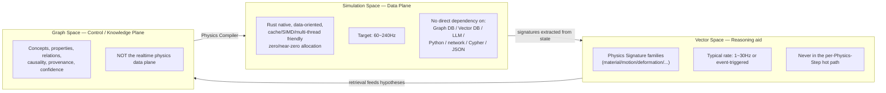

# GVPE — Vision（要件定義書）

**Rust Native Graph-Governed Vector Physics Engine**

## 0. 文档元数据

| 字段 | 取值 |
|---|---|
| 文档编号 | GVPE-DOC-00 |
| 文档类型 | 要件定義書 |
| 版本 | v0.2（标准化重写版） |
| 状态 | Draft |
| 适用阶段 | MVP |
| 关联系统 | GVPE / 总论 |
| 上游文档（输入基线） | — |
| 下游文档（被消费于） | GVPE-DOC-01, GVPE-DOC-02, GVPE-DOC-03, GVPE-DOC-04, GVPE-DOC-05, GVPE-DOC-06, GVPE-DOC-07, GVPE-DOC-08, GVPE-DOC-09, GVPE-DOC-10, GVPE-DOC-11, GVPE-DOC-12, GVPE-DOC-13, GVPE-DOC-14, GVPE-DOC-15, GVPE-DOC-16 |
| 编写者 | — |
| 审批者 | — |

## 1. 修订历史

| 版本 | 日期 | 修改者 | 修改内容 |
|---|---|---|---|
| v0.1 | — | — | 初稿（原始版本）；状态说明为 Draft v0.1 — 作为需求基线，取代 PRE 规范（`docs/archive/`） |
| v0.2 | 2026-08-19 | 标准化 pass | 转为 IPA 要件定義書 格式；叙事中文化；保留全部技术内容；补充文档元数据、修订历史、术语定义、关联文档、审批签字等标准章节 |

## 2. 文档目的

本文档是 GVPE（Graph-Governed Vector Physics Engine，Rust 自研实时物理引擎）的总论性要件定義書，用于在最抽象的层面上定义 GVPE 是什么、不是什么、必须遵守的禁区，以及构成其总体的三大空间（仿真空间 / 向量空间 / 图谱空间）。它不是架构说明书，也不约束实现细节；其作用是为后续 16 份配套设计文档奠定**不可违背的总纲**，尤其是六条 `GVPE-PROHIBIT-*` 禁令和"即使在完全禁用 Graph/Vector/AI/3DGS 的情况下，Rust Runtime 仍必须可独立作为商用实时物理引擎运行"这一不变式。

## 3. 适用范围

- **适用阶段**：MVP 阶段，作为后续所有 `GVPE-DOC-NN` 的基线；并对 Phase 1 及之后所有演进持续生效。
- **适用读者**：所有 GVPE 模块设计者、需求评审者、许可证审计者、跨引擎宿主集成方（Unity / Unreal / Godot / 自研引擎）。
- **不适用**：本文档不讨论任何具体 crate 内部 API、不规定数据结构细节、不评估第三方库选型。详细规约分别见 `04_architecture.md`、`05_runtime_design.md` 等下游文档。
- **强制边界**：本文档中列出的六条 `GVPE-PROHIBIT-*` 条款对每份下游文档都具有**绑定力**（binding），任何下游设计若无法说明自身尊重了哪一条、又如何遵守，则不得被接受。

## 4. 术语定义

| 术语 | 释义 |
|---|---|
| GVPE | Graph-Governed Vector Physics Engine，本文所述物理引擎的项目代号。 |
| Simulation Space（仿真空间） | 数据平面（Data Plane），由 Rust 原生、面向数据（data-oriented）、高速缓存友好、SIMD 与多线程友好的代码构成；目标 60~240 Hz。 |
| Vector Space（向量空间） | 推理辅助层（Reasoning Aid），承载多向量物理签名（Physics Signature families），典型调用频率 1~30 Hz 或事件触发；**永不出现在 per-step 热路径**。 |
| Graph Space（图谱空间） | 控制与知识平面（Control / Knowledge Plane），承载概念、属性、关系、因果、来源与置信度；**不是实时物理数据平面**。 |
| Physics Knowledge Graph, PKG | 物理知识图谱，唯一承载物理本体（ontology）、关系与因果链的图谱。 |
| Physics Signature | 物理签名，对物理状态的多向量表征，详见 §20。 |
| Physics Compiler | 物理编译器，**唯一的** Graph/Vector → Runtime 桥接器。 |
| 物理签名族 | material / motion / deformation / interaction / contact / energy / wave / field / environment / solver 等子签名集合。 |
| Runtime | 仿真运行时，GVPE 中实际执行物理求解的 Rust 代码部分，可被宿主经 C ABI 调用。 |
| C ABI | 通过 `gvpe-ffi` crate 暴露给 Unity / Unreal / Godot / 自研引擎的 C 兼容二进制接口。 |
| MVP | Minimum Viable Product，最小可行产品；本文对应首版可发布的 GVPE 形态。 |

## 5. 项目背景与约束

GVPE 的立项前提是：逆向物理推断（observation → parameters）目前缺乏系统化、可累积的解决方案；现有引擎要么是闭源的"性能黑盒"，要么是缺乏生产级实时核心的研究代码。因此 GVPE 决定**首先**自研实时物理核心，使其本身即具备独立商业价值；再在其上以**可选**形式叠加物理知识图谱与向量空间作为推理辅助，二者最终都必须被编译为普通的运行时参数（`PhysicsProfile`）下发到 Runtime——它们**绝不**能成为 Runtime 的运行时依赖。

由此引出**总纲级别的硬约束**，也是本文档最具约束力的部分：

- **GVPE-PROHIBIT-01**：不得以第三方完整物理引擎作为核心 Runtime。
- **GVPE-PROHIBIT-02**：不得对现有物理引擎进行薄包装后宣称自研。
- **GVPE-PROHIBIT-03**：不得让任何图数据库执行实时物理求解。
- **GVPE-PROHIBIT-04**：不得让任何向量数据库进入 per-frame 热路径。
- **GVPE-PROHIBIT-05**：不得让任何 LLM / AI 替代基础数值物理。
- **GVPE-PROHIBIT-06**：不得为架构优雅而牺牲实时性能。

每份下游文档都必须可对照这六条逐条自检。任何无法说明"我尊重了哪一条、是如何遵守的"的设计，不应被接受。

## 6. 功能需求 (GVPE-FR-XXX)

| ID | 描述 |
|---|---|
| GVPE-FR-VISION-01 | 三大空间（Simulation / Vector / Graph）必须在架构上可独立裁剪；裁剪掉 Graph 与 Vector 后，Runtime 仍须可独立运行并产出一致结果。 |
| GVPE-FR-VISION-02 | GVPE 必须以**自研**实时物理求解器为商业价值主体，且其源码必须**不包含**任何第三方完整物理引擎（禁止以 vendored / embedded / thinly-wrapped 形式混入）。 |
| GVPE-FR-VISION-03 | 公开论文、算法与开源实现**思路**可作为设计参考，但不得将任何第三方物理引擎作为 GVPE 自研求解器的一部分呈现。 |
| GVPE-FR-VISION-04 | Simulation Space 必须为 Rust 原生、面向数据、高速缓存 / SIMD / 多线程友好，并满足零分配或近零分配的工程标准。 |
| GVPE-FR-VISION-05 | Simulation Space 必须可在 60~240 Hz 目标频率下运行。 |
| GVPE-FR-VISION-06 | Simulation Space 不得对 Graph DB / Vector DB / LLM / Python / 网络 / Cypher / JSON 产生直接依赖。 |
| GVPE-FR-VISION-07 | Vector Space 必须承载多向量物理签名族（material / motion / deformation / ...），典型调用频率 1~30 Hz 或事件触发，**永远**不在 per-Physics-Step 热路径上。 |
| GVPE-FR-VISION-08 | Graph Space 承载概念、属性、关系、因果、来源与置信度；**不**承担实时物理数据平面角色。 |
| GVPE-FR-VISION-09 | Physics Compiler 必须是 Graph / Vector → Runtime 的**唯一**桥接路径；Runtime 不得直接查询 Graph 或 Vector。 |
| GVPE-FR-VISION-10 | GVPE 必须暴露 C ABI 表面，供 Unity / Unreal / Godot / 自研引擎以批处理方式交换数据。 |
| GVPE-FR-VISION-11 | 必须保留端到端闭环 Observation → Simulation → Comparison 的可扩展性，3DGS 方向未来接入不得要求对 §02–§04 进行破坏性重设计。 |
| GVPE-FR-VISION-12 | 必须显式维护一条长期流水线：Observation → Physical Interpretation → Physics Signature → Vector Retrieval → Physics Knowledge Graph → Hypothesis → Physics Compiler → PhysicsProfile → Self-developed Rust Solver → Simulation → Comparison → Parameter Optimization。 |

## 7. 非功能需求 (GVPE-NFR-XXX / GVPE-PERF-XXX / GVPE-LIC-XXX)

| ID | 类别 | 描述 |
|---|---|---|
| GVPE-NFR-001 | NFR | 即使 Graph、Vector、AI、3DGS 全部被禁用，Rust Runtime 仍必须是**完整、可独立运行、商用实时级、自研**的物理引擎，且经 C ABI 可被宿主调用——此为"穿越所有未来变更而必须存活的不变式"。 |
| GVPE-NFR-002 | NFR | 任何后续设计若会破坏该不变式，必须被拒绝或重设计；不得通过"豁免"绕过。 |
| GVPE-NFR-003 | NFR | 全部六条 `GVPE-PROHIBIT-*` 对每份下游文档具 binding 效力；每份设计文档必须显式声明其与各禁区的对应关系。 |
| GVPE-PERF-001 | PERF | Simulation Space 须在 60~240 Hz 范围内满足实时性指标；详细预算见 `14_performance_budget.md`。 |
| GVPE-PERF-002 | PERF | 不允许以牺牲实时性能换取架构优雅（与 `GVPE-PROHIBIT-06` 等价表述）。 |
| GVPE-LIC-001 | LIC | 不得引入任何未通过 `16_dependency_license.md` §2 完整矩阵审查的图数据库 / 向量数据库 / LLM 运行时。 |

## 8. 业务约束

| ID | 描述 |
|---|---|
| GVPE-PROHIBIT-01 | 不得以第三方完整物理引擎作为核心 Runtime。 |
| GVPE-PROHIBIT-02 | 不得对现有物理引擎进行薄包装后作为自研引擎呈现。 |
| GVPE-PROHIBIT-03 | 不得让任何图数据库执行实时物理求解。 |
| GVPE-PROHIBIT-04 | 不得让任何向量数据库进入 per-frame 热路径。 |
| GVPE-PROHIBIT-05 | 不得让任何 LLM / AI 替代基础数值物理。 |
| GVPE-PROHIBIT-06 | 不得为追求架构优雅而牺牲实时性能。 |

补充业务约束：

- **GCN-DOC-00-A**：本套件共 16 份核心文档（`01_requirements.md` ~ `16_dependency_license.md`），加上本文（`00_vision.md`），构成本轮（this pass）的完整设计文档集合；本轮政策为"骨架完整"——源 brief 的顶层概念均已就位且正确归位，本体论的叶级枚举保留但未展开为完整的 per-property unit/range/confidence 表（该展开属下一轮工作，已就地标记）；本文档不构成最终代码，而是需求与架构基线。
- **GCN-DOC-00-B**：本文档取代 `docs/archive/` 下的 PRE 规范系列；所有后续设计文档以本文档为输入基线（input baseline）。

## 9. 验收标准

- **AC-VISION-01**：每份下游文档在其 `## 关联文档` / 等价章节中显式引用 `GVPE-DOC-00`，并以一张表逐条说明自身对 `GVPE-PROHIBIT-01` ~ `GVPE-PROHIBIT-06` 的尊重与落实方式。
- **AC-VISION-02**：在完全禁用 `gvpe-graph` / `gvpe-vector` / `gvpe-compiler` / `gvpe-inference` / `gvpe-3dgs`（feature-gated out）的 build 中，至少存在一个能跑通 MVP 范围 rigid-body 场景的示例（具体实现细节见下游）。
- **AC-VISION-03**：本轮"骨架完整"政策下的产物集合（`00_vision.md` + `01_~16_*.md`）在目录结构、文档编号、上下游引用关系上自洽无缺。
- **AC-VISION-04**：由本文档派生出的 `GVPE-FR-XXX` / `GVPE-NFR-XXX` / `GVPE-PERF-XXX` / `GVPE-LIC-XXX` / `GVPE-PROHIBIT-XX` ID 在后续文档中可被精确引用，且无重复定义。

## 10. 关联文档

- **上游（输入基线）**：
  - `docs/archive/01_PRE_Requirements.md`（已归档的 PRE 规范，被本文档取代）
  - `docs/archive/02_PRE_Basic_Design.md`（已归档）
  - `docs/archive/03_PRE_Architecture_ADR.md`（已归档）
- **下游（被消费于）**：
  - `GVPE-DOC-01` `docs/00_foundation/01_requirements.md`（要件定义）
  - `GVPE-DOC-02` `docs/00_foundation/02_physics_ontology.md`（物理本体）
  - `GVPE-DOC-03` `docs/01_architecture/03_graph_schema.md`（图谱模式）
  - `GVPE-DOC-04` `docs/01_architecture/04_architecture.md`（架构总览）
  - `GVPE-DOC-05` `docs/01_architecture/05_runtime_design.md`（运行时设计）
  - `GVPE-DOC-06` `docs/02_modules/06_collision_design.md`（碰撞设计）
  - `GVPE-DOC-07` `docs/02_modules/07_solver_design.md`（求解器设计）
  - `GVPE-DOC-08` `docs/01_architecture/08_memory_design.md`（内存设计）
  - `GVPE-DOC-09` `docs/01_architecture/09_parallel_design.md`（并行设计）
  - `GVPE-DOC-10` `docs/02_modules/10_ffi_design.md`（C ABI 设计）
  - `GVPE-DOC-11` `docs/02_modules/11_vector_design.md`（向量空间设计）
  - `GVPE-DOC-12` `docs/02_modules/12_energy_wave_field_design.md`（能量/波/场 设计）
  - `GVPE-DOC-13` `docs/05_future/13_3dgs_future_design.md`（3DGS 未来设计）
  - `GVPE-DOC-14` `docs/03_cross_cutting/14_performance_budget.md`（性能预算）
  - `GVPE-DOC-15` `docs/03_cross_cutting/15_testing_strategy.md`（测试策略）
  - `GVPE-DOC-16` `docs/03_cross_cutting/16_dependency_license.md`（依赖许可证）

## 11. 审批签字

| 角色 | 姓名 | 签字 | 日期 |
|---|---|---|---|
| 编写 | — | | |
| 校对 | | | |
| 审批 | | | |

---

## 12. 正文

> 本节保留原文档结构（§0.1 ~ §0.6），所有叙述翻译为中文；技术名词、ID 标识符、代码块、mermaid 图、ASCII 树图保持英文原样。

### 0.1 GVPE 的精确定义

GVPE 是一个**自研**的、实时的 Rust 物理求解器核心；其离线侧由物理知识图谱（Physics Knowledge Graph）治理，通过物理向量空间（Physics Vector Space）检索，且物理编译器（Physics Compiler）是二者与 Runtime 之间的**唯一**桥接器。GVPE **不是** Rapier / Bullet / PhysX / Jolt / Box2D 的封装层。公开论文、算法与开源实现的**思路**可以作为设计参考；**任何**第三方物理引擎都不得以 vendored、embedded 或 thinly-wrapped 形式被包装为 GVPE 的自研求解器。

### 0.2 显式禁令（禁止事項，对所有后续文档 binding）

- **GVPE-PROHIBIT-01**：不得以第三方完整物理引擎作为核心 Runtime。
- **GVPE-PROHIBIT-02**：不得对现有物理引擎进行薄包装后以自研名义呈现。
- **GVPE-PROHIBIT-03**：不得让任何图数据库执行实时物理求解。
- **GVPE-PROHIBIT-04**：不得让任何向量数据库进入 per-frame 热路径。
- **GVPE-PROHIBIT-05**：不得让任何 LLM / AI 替代基础数值物理。
- **GVPE-PROHIBIT-06**：不得为追求架构优雅而牺牲实时性能。

每份后续文档都必须能对照这六条逐条自检。任何设计若无法说明自身尊重了哪一条、又是如何遵守的，则**不应**被接受。

### 0.3 三大空间（总體構造）



### 0.4 长期目标流水线

```
Observation → Physical Interpretation → Physics Signature → Vector Retrieval
    → Physics Knowledge Graph → Hypothesis → Physics Compiler → PhysicsProfile
    → Self-developed Rust Solver → Simulation → Comparison → Parameter Optimization
```

### 0.5 穿越所有未来设计变更而必须存活的不变式

**即使在 Graph、Vector、AI、3DGS 全部被禁用的极限情况下，Rust Runtime 单独存在时仍必须是一个完整、可独立运行、商用实时级、自研的物理引擎，并且必须可经 C ABI 被宿主游戏引擎调用。**

任何后续文档都不得引入破坏该不变式的依赖。任何会破坏它的设计，必须被拒绝或重设计，**不得**通过"豁免"绕过。

### 0.6 本轮文档集合

`01_requirements.md` `02_physics_ontology.md` `03_graph_schema.md` `04_architecture.md`
`05_runtime_design.md` `06_collision_design.md` `07_solver_design.md` `08_memory_design.md`
`09_parallel_design.md` `10_ffi_design.md` `11_vector_design.md` `12_energy_wave_field_design.md`
`13_3dgs_future_design.md` `14_performance_budget.md` `15_testing_strategy.md`
`16_dependency_license.md`

本轮的深度政策（明确）：**骨架完整**——源 brief 的每个顶层概念均已存在且正确归位；本体论叶级枚举保留，但未展开为完整的 per-property unit/range/confidence 表（该展开属下一轮工作，已就地标记其应发生之处）。本文档集合**不**构成最终代码，而是需求与架构的基线。
