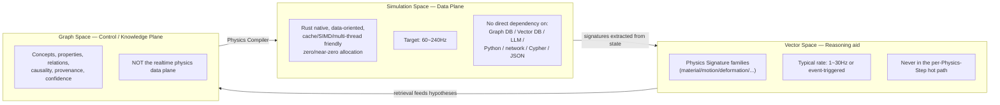

# GVPE — Vision（総論）

**Rust Native Graph-Governed Vector Physics Engine**

Status: Draft v0.1 — Baseline for requirements. Supersedes the PRE spec (`docs/archive/`).

## 0.1 What GVPE is, precisely

A self-developed, real-time Rust physics solver core, governed offline by a Physics Knowledge
Graph and searched via a Physics Vector Space, with a Physics Compiler as the only bridge between
them and the runtime. Not a wrapper around Rapier/Bullet/PhysX/Jolt/Box2D. Public papers, algorithms,
and open-source implementation *ideas* may inform the design; no third-party physics engine may be
vendored, embedded, or thinly wrapped and presented as GVPE's own solver.

## 0.2 Explicit prohibitions（禁止事項, binding on every later document）

- **GVPE-PROHIBIT-01**: No third-party complete physics engine as the core Runtime.
- **GVPE-PROHIBIT-02**: No wrapping an existing physics engine and presenting it as self-developed.
- **GVPE-PROHIBIT-03**: No Graph DB performing real-time physics solving.
- **GVPE-PROHIBIT-04**: No Vector DB entering the per-frame hot path.
- **GVPE-PROHIBIT-05**: No LLM/AI substituting for base numerical physics.
- **GVPE-PROHIBIT-06**: No sacrificing real-time performance for architectural elegance.

Every subsequent document must be checkable against these six lines. A design that cannot state
which line it respects, and how, is not ready to be accepted.

## 0.3 Three spaces（総体構造）



## 0.4 Long-term goal pipeline

```
Observation → Physical Interpretation → Physics Signature → Vector Retrieval
    → Physics Knowledge Graph → Hypothesis → Physics Compiler → PhysicsProfile
    → Self-developed Rust Solver → Simulation → Comparison → Parameter Optimization
```

## 0.5 The one invariant that must survive every future design change

**Even with Graph, Vector, AI, and 3DGS entirely disabled, the Rust Runtime alone must remain a
complete, independently runnable, commercial-real-time-grade, self-developed physics engine,
callable from a game engine via C ABI.** No later document may introduce a dependency that breaks
this invariant. Any design that would, must be rejected or redesigned, not exempted.

## 0.6 Document set (this pass)

`01_requirements.md` `02_physics_ontology.md` `03_graph_schema.md` `04_architecture.md`
`05_runtime_design.md` `06_collision_design.md` `07_solver_design.md` `08_memory_design.md`
`09_parallel_design.md` `10_ffi_design.md` `11_vector_design.md` `12_energy_wave_field_design.md`
`13_3dgs_future_design.md` `14_performance_budget.md` `15_testing_strategy.md`
`16_dependency_license.md`

Depth policy for this pass (explicit): skeleton-complete — every top-level concept from the source
brief is present and correctly placed, ontology leaf enumerations are kept but not expanded into
full per-property unit/range/confidence tables (that expansion is next-pass work, flagged inline
where it's owed). Nothing here is final code; this is the requirements/architecture baseline.
