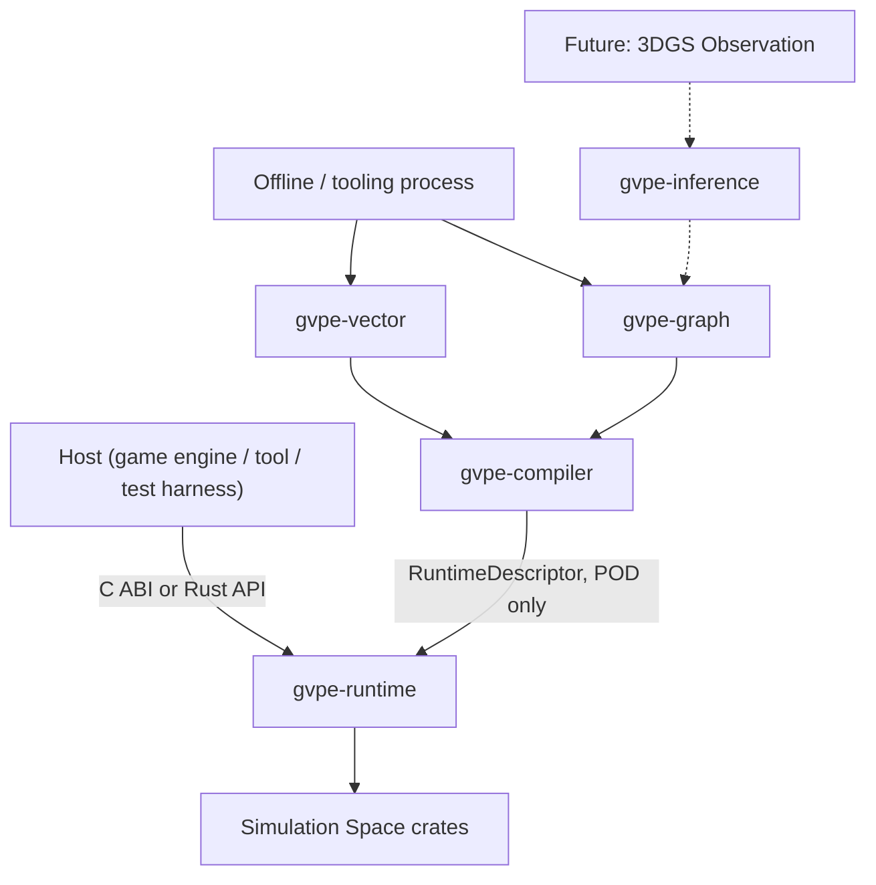

# GVPE — Architecture（基本設計書）

## 0. 文档元数据

| 字段 | 取值 |
|---|---|
| 文档编号 | GVPE-DOC-04 |
| 文档类型 | 基本設計書 |
| 版本 | v0.2（标准化重写版） |
| 状态 | Draft |
| 适用阶段 | MVP |
| 关联系统 | GVPE / 全部 crate |
| 上游文档（输入基线） | GVPE-DOC-01（00_vision.md），GVPE-DOC-02（02_physics_ontology.md），GVPE-DOC-03（03_graph_schema.md） |
| 下游文档（被消费于） | GVPE-DOC-05（05_runtime_design.md），GVPE-DOC-06（06_collision_design.md），GVPE-DOC-07（07_solver_design.md），GVPE-DOC-08（08_memory_design.md），GVPE-DOC-09（09_parallel_design.md），GVPE-DOC-10（10_ffi_design.md），GVPE-DOC-11（11_vector_design.md），GVPE-DOC-13（13_3dgs_future_design.md） |
| 编写者 | — |
| 审批者 | — |

## 1. 修订历史

| 版本 | 日期 | 修改者 | 修改内容 |
|---|---|---|---|
| v0.1 | — | — | 初稿（原始版本） |
| v0.2 | 2026-08-19 | 标准化 pass | 转为 IPA 基本設計書 格式；叙事中文化；保留全部技术内容；补充文档元数据、修订历史、术语定义、关联文档、审批签字等标准章节 |

## 2. 文档目的

本基本設計書定义 GVPE 引擎的整体 crate 模块地图、依赖方向、编译器边界、Law → Model → Solver 可追溯性表、GPU 扩展约束、PhysicsLOD 钩子、上下文图与部署模型。文档目的是为下游各子模块设计（运行时、碰撞、求解器、内存、并行、FFI、向量）提供统一架构基线，并保证 Graph / Vector / Simulation 三大空间的边界与编译期转换规则被严格遵守。

## 3. 适用范围

本文件适用于 GVPE 工作区下的全部 crate（参见 §6.1）。对各 crate 的具体接口、模块内部细节设计，参见各自对应的 GVPE-DOC-05 ~ GVPE-DOC-13 文档。

## 4. 术语定义

| 术语 | 说明 |
|---|---|
| 仿真空间（Simulation Space） | 包含全部运行时仿真相关 crate 的空间，不含任何图 / 向量类型 |
| 向量空间（Vector Space） | 由 `gvpe-vector` 单独承载的物理签名 / 嵌入 / 检索空间 |
| 图谱空间（Graph Space） | 由 `gvpe-graph`、`gvpe-compiler`、`gvpe-inference`、`gvpe-3dgs` 组成的离线 / 编译器阶段空间 |
| 物理编译器（Physics Compiler） | 唯一同时依赖 Graph / Vector 空间和 Simulation 空间（仅 `gvpe-core` 中的 `PhysicsProfile` / `RuntimeDescriptor` 类型）的 crate |
| `RuntimeDescriptor` | 编译器输出的纯 POD 描述符，仿真空间运行时仅消费此描述符 |
| `PhysicsLod` | 物理细节层级枚举，从 `Lod0Full` 到 `Lod4Static`，MVP 全量硬编码为 `Lod0Full` |
| `ConstraintRow` | 求解器迭代的最小行格式（参见 GVPE-DOC-07） |
| AC-02 | 验收标准 02：`gvpe-runtime` 不得直接或传递依赖 `gvpe-graph` / `gvpe-vector` |
| NG3 | 全局禁令 03：架构必须不为将来 GPU 集成制造障碍（但 MVP 不交付 GPU） |

## 5. 前提与约束

1. 依赖方向具有机械检查保证（GVPE-NFR-003, AC-02）：箭头一律"被依赖方 ← 依赖方"方向；任何向上的箭头均被禁止。
2. 编译器边界是 Graph/Vector → Runtime 的**唯一**允许通道（实现 GVPE-DOC-03 §3）。
3. GPU 不在 MVP 范围内，但 `ConstraintRow` 与 `gvpe-memory` 的 buffer 必须可被未来 `gvpe-gpu` crate 直接消费而无需重设计（NG3）。
4. `PhysicsLOD` 从 day-one 即出现在 `RuntimeDescriptor` 中，MVP 全部硬编码为 `Lod0Full`。LOD 选择逻辑归属 `gvpe-inference` / host，不属于 `gvpe-runtime`。
5. 部署形态为单一可嵌入式库（`cdylib` / `staticlib` / `rlib`），不需要为仿真空间运行部署网络服务或独立图 / 向量数据库进程（GVPE-FR-001）。

## 6. 系统架构 / 模块设计

### 6.1 模块地图（crate 列表）

```
gvpe/
├── gvpe-math        # vectors, quaternions, matrices — no allocation, SIMD-ready types
├── gvpe-core        # Handle/ID types, PhysicsProfile, RuntimeDescriptor
├── gvpe-memory      # arena/pool/slab/frame allocator (08_memory_design.md)
├── gvpe-shape       # sphere/box/capsule/plane/convex/mesh/heightfield/compound
├── gvpe-collision   # broad + narrow phase (06_collision_design.md)
├── gvpe-dynamics    # rigid body state, integration
├── gvpe-constraint  # ConstraintRow, contact/joint constraints (Runtime Constraint Graph)
├── gvpe-solver      # sequential impulse / PGS, later XPBD (07_solver_design.md)
├── gvpe-island      # connected components → physics islands
├── gvpe-scheduler   # Execution Graph, job DAG, work stealing (09_parallel_design.md)
├── gvpe-runtime     # top-level API, owns the frame loop the HOST drives
├── gvpe-ffi         # C ABI surface (10_ffi_design.md)
├── gvpe-vector      # Physics Signature, embeddings, retrieval (11_vector_design.md)
├── gvpe-graph       # Physics Knowledge Graph storage + query (03_graph_schema.md)
├── gvpe-compiler    # Graph/Vector → PhysicsProfile → RuntimeDescriptor
├── gvpe-inference    # Hypothesis generation, parameter optimization (13_3dgs_future_design.md)
└── gvpe-3dgs         # Dynamic 3DGS observation ingestion (interface-only, MVP)
```

### 6.2 三大空间到 crate 的映射

| 空间（`00_vision.md` §0.3） | 包含模块 |
|---|---|
| 仿真空间（Simulation Space） | `gvpe-math, gvpe-core, gvpe-memory, gvpe-shape, gvpe-collision, gvpe-dynamics, gvpe-constraint, gvpe-solver, gvpe-island, gvpe-scheduler, gvpe-runtime, gvpe-ffi` |
| 向量空间（Vector Space） | `gvpe-vector` |
| 图谱空间（Graph Space） | `gvpe-graph, gvpe-compiler, gvpe-inference, gvpe-3dgs` |

### 6.3 依赖方向（机械检查，GVPE-NFR-003, AC-02）

```
        gvpe-graph / gvpe-vector / gvpe-inference / gvpe-3dgs
                              │
                              ▼
                        gvpe-compiler
                              │
                              ▼
   gvpe-math ← gvpe-core ← gvpe-memory ← gvpe-shape ← gvpe-collision ← gvpe-dynamics
        ← gvpe-constraint ← gvpe-solver ← gvpe-island ← gvpe-scheduler ← gvpe-runtime ← gvpe-ffi
```

- 箭头读作"被依赖方 ← 依赖方"。
- 任何箭头不得指向上方。
- `gvpe-compiler` 是**唯一**同时依赖 Graph/Vector 空间 crate 和 Simulation 空间 crate（仅 `gvpe-core` 中的 `PhysicsProfile` / `RuntimeDescriptor` 类型）的 crate。

## 7. 接口设计

### 7.1 编译器边界（实现 GVPE-DOC-03 §3）

```rust
trait PhysicsCompiler {
    fn compile(&self, graph_query_result: GraphQueryResult) -> Result<PhysicsProfile, CompileError>;
}

struct RuntimeDescriptor {
    profiles: Vec<PhysicsProfile>,   // POD, no graph/vector types
    // Handle/ID/Index/Numeric/BitFlags/Aligned-buffer only, per 03_graph_schema.md §3
}
```

- `gvpe-runtime` 在场景初始化时接受 `RuntimeDescriptor`。
- `gvpe-runtime` 永不导入 `gvpe-graph` 或 `gvpe-vector` 的类型，无论是直接还是传递依赖（AC-02）。

## 8. 数据模型

### 8.1 Law → Model → Solver 可追溯表（落实 `02_physics_ontology.md` §14/§15）

| PhysicalLaw（图，知识层） | PhysicalModel（图） | Solver（仿真空间，MVP 状态） |
|---|---|---|
| NewtonLaw, ConservationOfMomentum | RigidBodyModel | `gvpe-solver` sequential impulse — **已实现，MVP** |
| HookeLaw, ConstitutiveLaw | ElasticSolidModel, PBDModel/XPBDModel | 保留，Phase 6+ |
| NavierStokes | FluidModel | 保留，未排期 |
| WaveEquation | — | 保留，`12_energy_wave_field_design.md` |
| MaxwellEquation | — | 完全不在可见路线图范围内 |

`PhysicalLaw` 节点存在但 Solver 列为空是预期且正确的（知识 ≠ 义务，依据本体论规则）。本表正是使该区分可审计的具体载体。

### 8.2 PhysicsLOD 钩子（落实 `02_physics_ontology.md` §19）

```rust
enum PhysicsLod { Lod0Full, Lod1Reduced, Lod2Approximation, Lod3CachedBehavior, Lod4Static }
```

- 从 day-one 即出现在 `RuntimeDescriptor` 中，按 body / entity 维度挂载。
- MVP 全部硬编码为 `Lod0Full`。
- LOD 选择逻辑（距离 / 屏幕重要性 / 预算等）由 `gvpe-inference` / host 负责，不属于 `gvpe-runtime` 职责。

## 9. 处理流程

### 9.1 上下文图（Context Diagram）



- 虚线边（`gvpe-3dgs` / `gvpe-inference`）属于 `13_3dgs_future_design.md` 范畴，MVP 阶段不连通。
- 虚线仅用于确认：它们不需要与 §7.1 已定义的编译器边界不同的新边界。

### 9.2 部署模型

- 单一可嵌入式库（来自 `gvpe-ffi` 与 `gvpe-runtime` 的 `cdylib` / `staticlib` / `rlib` target）。
- 不需要网络服务，不需要为纯仿真空间构建单独的图 / 向量数据库进程（GVPE-FR-001）。
- 当启用 Graph / Vector 时，其后端可以是进程内嵌入，也可以是独立进程 —— 该选择权归 `16_dependency_license.md`，不属于本文件决定范围。

### 9.3 GPU 扩展性约束（NG3，MVP 不交付 GPU）

- 当前不存在 GPU 计算 crate。
- 本基线对未来的约束：`gvpe-solver` 的 `ConstraintRow` 布局（`07_solver_design.md` §2）与 `gvpe-memory` 的 buffer 类型（`08_memory_design.md` §2）必须可被描述为扁平、可对齐的数组 —— 这是未来 `gvpe-gpu` crate 可在不重设计前提下消费的数据形态。
- 本约束是数据布局约束，不是已排期的可交付项。

## 10. 关联需求

| 需求 ID | 中文描述 | 在本文件中的落地点 |
|---|---|---|
| GVPE-FR-001 | 单一可嵌入式库交付，不强制独立数据库 / 服务进程 | §9.2 部署模型 |
| GVPE-NFR-003 | crate 依赖方向需机械检查 | §6.3 依赖方向图 |
| AC-02 | `gvpe-runtime` 不得直接或传递依赖 `gvpe-graph` / `gvpe-vector` | §6.3、§7.1 |
| NG3 | 架构必须不为将来 GPU 集成制造障碍 | §9.3 GPU 扩展性约束 |
| 00_vision.md §0.1/§0.2 | 物理 / 求解 / 编译器为自研，第三方仅可作辅助 | §6.1 全部模块为自研 `gvpe-` crate |
| 00_vision.md §0.3 | 三大空间边界 | §6.2 三空间到 crate 映射 |
| 02_physics_ontology.md §14/§15 | Law → Model → Solver 可追溯关系 | §8.1 可追溯表 |
| 02_physics_ontology.md §19 | PhysicsLOD 本体层定义 | §8.2 PhysicsLOD 钩子 |

## 11. 关联文档

- 上游：`docs/00_vision.md`（GVPE-DOC-01），`docs/01_architecture/02_physics_ontology.md`（GVPE-DOC-02），`docs/01_architecture/03_graph_schema.md`（GVPE-DOC-03）
- 下游：`docs/01_architecture/05_runtime_design.md`（GVPE-DOC-05），`docs/02_modules/06_collision_design.md`（GVPE-DOC-06），`docs/02_modules/07_solver_design.md`（GVPE-DOC-07），`docs/01_architecture/08_memory_design.md`（GVPE-DOC-08），`docs/01_architecture/09_parallel_design.md`（GVPE-DOC-09），`docs/01_architecture/10_ffi_design.md`（GVPE-DOC-10），`docs/01_architecture/11_vector_design.md`（GVPE-DOC-11），`docs/00_vision/12_energy_wave_field_design.md`（GVPE-DOC-12），`docs/00_vision/13_3dgs_future_design.md`（GVPE-DOC-13），`docs/00_vision/16_dependency_license.md`（GVPE-DOC-16）
- 平行引用：`docs/01_requirements.md`（GVPE-DOC-01 中需求章节）

## 12. 审批签字

| 角色 | 姓名 | 签字 | 日期 |
|---|---|---|---|
| 编写 |  |  |  |
| 校对 |  |  |  |
| 审批 |  |  |  |

---

## 13. 正文

Input baseline: `01_requirements.md`, `02_physics_ontology.md`, `03_graph_schema.md`.

## 4.1 Module map

```
gvpe/
├── gvpe-math        # vectors, quaternions, matrices — no allocation, SIMD-ready types
├── gvpe-core        # Handle/ID types, PhysicsProfile, RuntimeDescriptor
├── gvpe-memory      # arena/pool/slab/frame allocator (08_memory_design.md)
├── gvpe-shape       # sphere/box/capsule/plane/convex/mesh/heightfield/compound
├── gvpe-collision   # broad + narrow phase (06_collision_design.md)
├── gvpe-dynamics    # rigid body state, integration
├── gvpe-constraint  # ConstraintRow, contact/joint constraints (Runtime Constraint Graph)
├── gvpe-solver      # sequential impulse / PGS, later XPBD (07_solver_design.md)
├── gvpe-island      # connected components → physics islands
├── gvpe-scheduler   # Execution Graph, job DAG, work stealing (09_parallel_design.md)
├── gvpe-runtime     # top-level API, owns the frame loop the HOST drives
├── gvpe-ffi         # C ABI surface (10_ffi_design.md)
├── gvpe-vector      # Physics Signature, embeddings, retrieval (11_vector_design.md)
├── gvpe-graph       # Physics Knowledge Graph storage + query (03_graph_schema.md)
├── gvpe-compiler    # Graph/Vector → PhysicsProfile → RuntimeDescriptor
├── gvpe-inference    # Hypothesis generation, parameter optimization (13_3dgs_future_design.md)
└── gvpe-3dgs         # Dynamic 3DGS observation ingestion (interface-only, MVP)
```

## 4.2 Three-space to module mapping

| Space (`00_vision.md` §0.3) | Modules |
|---|---|
| Simulation Space | `gvpe-math, gvpe-core, gvpe-memory, gvpe-shape, gvpe-collision, gvpe-dynamics, gvpe-constraint, gvpe-solver, gvpe-island, gvpe-scheduler, gvpe-runtime, gvpe-ffi` |
| Vector Space | `gvpe-vector` |
| Graph Space | `gvpe-graph, gvpe-compiler, gvpe-inference, gvpe-3dgs` |

## 4.3 Dependency direction (binding, mechanically checked — GVPE-NFR-003, AC-02)

```
        gvpe-graph / gvpe-vector / gvpe-inference / gvpe-3dgs
                              │
                              ▼
                        gvpe-compiler
                              │
                              ▼
   gvpe-math ← gvpe-core ← gvpe-memory ← gvpe-shape ← gvpe-collision ← gvpe-dynamics
        ← gvpe-constraint ← gvpe-solver ← gvpe-island ← gvpe-scheduler ← gvpe-runtime ← gvpe-ffi
```
Arrows read "depended on by". No arrow may point upward. `gvpe-compiler` is the **only** crate
depending on both a Graph/Vector-space crate and a Simulation-space crate (`gvpe-core`, for
`PhysicsProfile`/`RuntimeDescriptor` types only).

## 4.4 The Compiler boundary (implements `03_graph_schema.md` §3)

```rust
trait PhysicsCompiler {
    fn compile(&self, graph_query_result: GraphQueryResult) -> Result<PhysicsProfile, CompileError>;
}

struct RuntimeDescriptor {
    profiles: Vec<PhysicsProfile>,   // POD, no graph/vector types
    // Handle/ID/Index/Numeric/BitFlags/Aligned-buffer only, per 03_graph_schema.md §3
}
```
`gvpe-runtime` accepts a `RuntimeDescriptor` at scene setup; it never imports `gvpe-graph` or
`gvpe-vector` types, directly or transitively (AC-02).

## 4.5 Law → Model → Solver traceability (operationalizes `02_physics_ontology.md` §14/§15)

| PhysicalLaw (graph, knowledge-only) | PhysicalModel (graph) | Solver (Simulation Space, MVP status) |
|---|---|---|
| NewtonLaw, ConservationOfMomentum | RigidBodyModel | `gvpe-solver` sequential impulse — **implemented, MVP** |
| HookeLaw, ConstitutiveLaw | ElasticSolidModel, PBDModel/XPBDModel | reserved, Phase 6+ |
| NavierStokes | FluidModel | reserved, not scheduled |
| WaveEquation | — | reserved, `12_energy_wave_field_design.md` |
| MaxwellEquation | — | out of scope entirely for the foreseeable roadmap |

A `PhysicalLaw` node existing with no Solver row here is expected and correct (knowledge ≠
obligation, per the ontology rule) — this table is exactly what makes that distinction auditable.

## 4.6 GPU (explicitly out of MVP, architecture must not preclude it — NG3)

No GPU compute crate exists yet. The constraint on this baseline: `gvpe-solver`'s `ConstraintRow`
layout (`07_solver_design.md` §2) and `gvpe-memory`'s buffer types (`08_memory_design.md` §2) must
be describable as flat, alignable arrays — a data shape a future `gvpe-gpu` crate could consume
without a redesign. This is a data-layout constraint, not a scheduled deliverable.

## 4.7 PhysicsLOD hook (operationalizes `02_physics_ontology.md` §19)

```rust
enum PhysicsLod { Lod0Full, Lod1Reduced, Lod2Approximation, Lod3CachedBehavior, Lod4Static }
```

Present in `RuntimeDescriptor` per body/entity from day one; MVP hardcodes `Lod0Full` for every
entry. Selection logic (distance/screen importance/budget/etc.) is `gvpe-inference`/host
responsibility, not `gvpe-runtime`'s.

## 4.8 Context diagram


The dashed edges (`gvpe-3dgs`/`gvpe-inference`) are `13_3dgs_future_design.md` territory and are
not wired up in MVP — shown here only to confirm they don't require a different Compiler boundary
than the one already defined in §4.4.

## 4.9 Deployment model

Single embeddable library (`cdylib`/`staticlib`/`rlib` targets from `gvpe-ffi` and `gvpe-runtime`
respectively). No network service, no separate graph/vector database process required for the
Simulation-Space-only build (GVPE-FR-001). When Graph/Vector are enabled, their backing store may
be embedded-in-process or a separate process — that choice is `16_dependency_license.md`'s to make,
not this document's.
