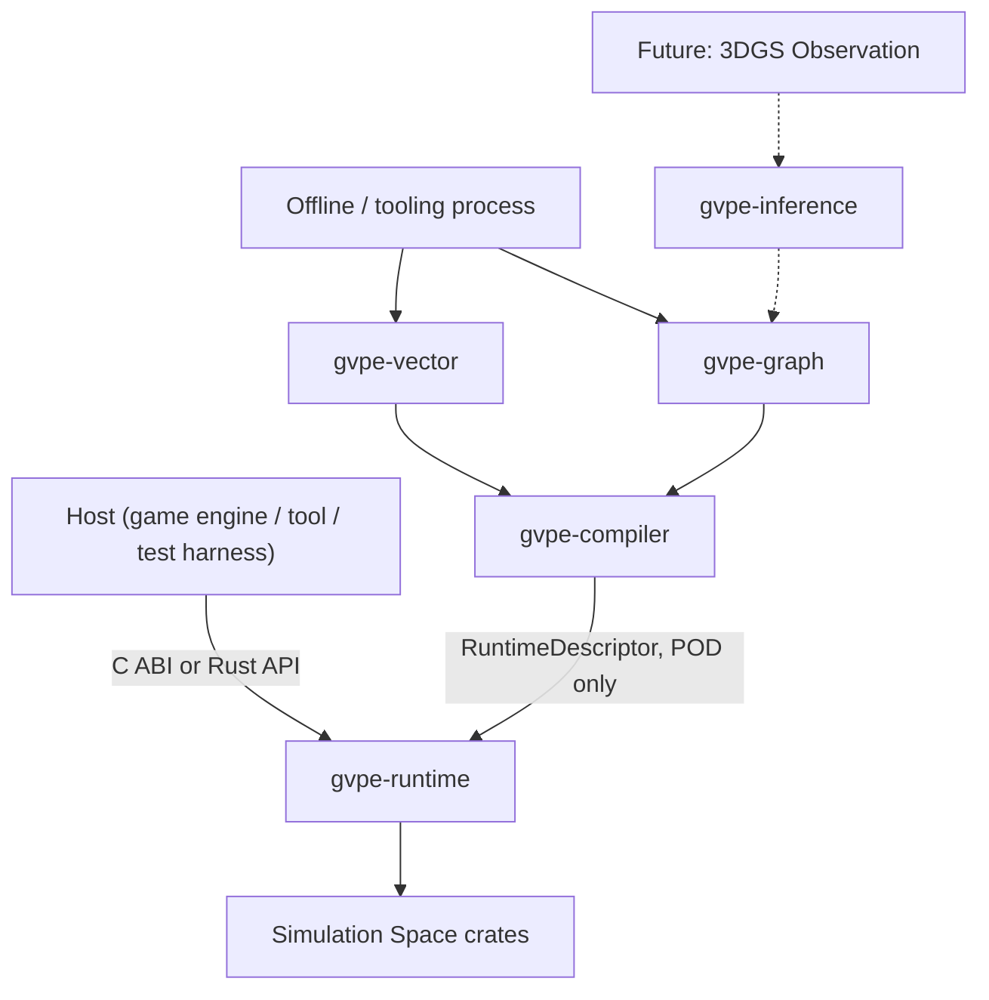

# GVPE — Architecture（アーキテクチャ）

Input baseline: `01_requirements.md`, `02_physics_ontology.md`, `03_graph_schema.md`.

## 4.1 Module map

```
gvpe/
├── gvpe-math        # vectors, quaternions, matrices — no allocation, SIMD-ready types
├── gvpe-core        # Handle/ID types, PhysicsProfile, RuntimeDescriptor
├── gvpe-memory      # arena/pool/slab/frame allocator (08_memory_design.md)
├── gvpe-shape       # sphere/box/capsule/plane/convex/mesh/heightfield/compound
├── gvpe-collision   # broad + narrow phase (06_collision_design.md)
├── gvpe-dynamics    # rigid body state, integration
├── gvpe-constraint  # ConstraintRow, contact/joint constraints (Runtime Constraint Graph)
├── gvpe-solver      # sequential impulse / PGS, later XPBD (07_solver_design.md)
├── gvpe-island      # connected components → physics islands
├── gvpe-scheduler   # Execution Graph, job DAG, work stealing (09_parallel_design.md)
├── gvpe-runtime     # top-level API, owns the frame loop the HOST drives
├── gvpe-ffi         # C ABI surface (10_ffi_design.md)
├── gvpe-vector      # Physics Signature, embeddings, retrieval (11_vector_design.md)
├── gvpe-graph       # Physics Knowledge Graph storage + query (03_graph_schema.md)
├── gvpe-compiler    # Graph/Vector → PhysicsProfile → RuntimeDescriptor
├── gvpe-inference    # Hypothesis generation, parameter optimization (13_3dgs_future_design.md)
└── gvpe-3dgs         # Dynamic 3DGS observation ingestion (interface-only, MVP)
```

## 4.2 Three-space to module mapping

| Space (`00_vision.md` §0.3) | Modules |
|---|---|
| Simulation Space | `gvpe-math, gvpe-core, gvpe-memory, gvpe-shape, gvpe-collision, gvpe-dynamics, gvpe-constraint, gvpe-solver, gvpe-island, gvpe-scheduler, gvpe-runtime, gvpe-ffi` |
| Vector Space | `gvpe-vector` |
| Graph Space | `gvpe-graph, gvpe-compiler, gvpe-inference, gvpe-3dgs` |

## 4.3 Dependency direction (binding, mechanically checked — GVPE-NFR-003, AC-02)

```
        gvpe-graph / gvpe-vector / gvpe-inference / gvpe-3dgs
                              │
                              ▼
                        gvpe-compiler
                              │
                              ▼
   gvpe-math ← gvpe-core ← gvpe-memory ← gvpe-shape ← gvpe-collision ← gvpe-dynamics
        ← gvpe-constraint ← gvpe-solver ← gvpe-island ← gvpe-scheduler ← gvpe-runtime ← gvpe-ffi
```
Arrows read "depended on by". No arrow may point upward. `gvpe-compiler` is the **only** crate
depending on both a Graph/Vector-space crate and a Simulation-space crate (`gvpe-core`, for
`PhysicsProfile`/`RuntimeDescriptor` types only).

## 4.4 The Compiler boundary (implements `03_graph_schema.md` §3)

```rust
trait PhysicsCompiler {
    fn compile(&self, graph_query_result: GraphQueryResult) -> Result<PhysicsProfile, CompileError>;
}

struct RuntimeDescriptor {
    profiles: Vec<PhysicsProfile>,   // POD, no graph/vector types
    // Handle/ID/Index/Numeric/BitFlags/Aligned-buffer only, per 03_graph_schema.md §3
}
```
`gvpe-runtime` accepts a `RuntimeDescriptor` at scene setup; it never imports `gvpe-graph` or
`gvpe-vector` types, directly or transitively (AC-02).

## 4.5 Law → Model → Solver traceability (operationalizes `02_physics_ontology.md` §14/§15)

| PhysicalLaw (graph, knowledge-only) | PhysicalModel (graph) | Solver (Simulation Space, MVP status) |
|---|---|---|
| NewtonLaw, ConservationOfMomentum | RigidBodyModel | `gvpe-solver` sequential impulse — **implemented, MVP** |
| HookeLaw, ConstitutiveLaw | ElasticSolidModel, PBDModel/XPBDModel | reserved, Phase 6+ |
| NavierStokes | FluidModel | reserved, not scheduled |
| WaveEquation | — | reserved, `12_energy_wave_field_design.md` |
| MaxwellEquation | — | out of scope entirely for the foreseeable roadmap |

A `PhysicalLaw` node existing with no Solver row here is expected and correct (knowledge ≠
obligation, per the ontology rule) — this table is exactly what makes that distinction auditable.

## 4.6 GPU (explicitly out of MVP, architecture must not preclude it — NG3)

No GPU compute crate exists yet. The constraint on this baseline: `gvpe-solver`'s `ConstraintRow`
layout (`07_solver_design.md` §2) and `gvpe-memory`'s buffer types (`08_memory_design.md` §2) must
be describable as flat, alignable arrays — a data shape a future `gvpe-gpu` crate could consume
without a redesign. This is a data-layout constraint, not a scheduled deliverable.

## 4.7 PhysicsLOD hook (operationalizes `02_physics_ontology.md` §19)

```rust
enum PhysicsLod { Lod0Full, Lod1Reduced, Lod2Approximation, Lod3CachedBehavior, Lod4Static }
```
Present in `RuntimeDescriptor` per body/entity from day one; MVP hardcodes `Lod0Full` for every
entry. Selection logic (distance/screen importance/budget/etc.) is `gvpe-inference`/host
responsibility, not `gvpe-runtime`'s.

## 4.8 Context diagram


The dashed edges (`gvpe-3dgs`/`gvpe-inference`) are `13_3dgs_future_design.md` territory and are
not wired up in MVP — shown here only to confirm they don't require a different Compiler boundary
than the one already defined in §4.4.

## 4.9 Deployment model

Single embeddable library (`cdylib`/`staticlib`/`rlib` targets from `gvpe-ffi` and `gvpe-runtime`
respectively). No network service, no separate graph/vector database process required for the
Simulation-Space-only build (GVPE-FR-001). When Graph/Vector are enabled, their backing store may
be embedded-in-process or a separate process — that choice is `16_dependency_license.md`'s to make,
not this document's.
