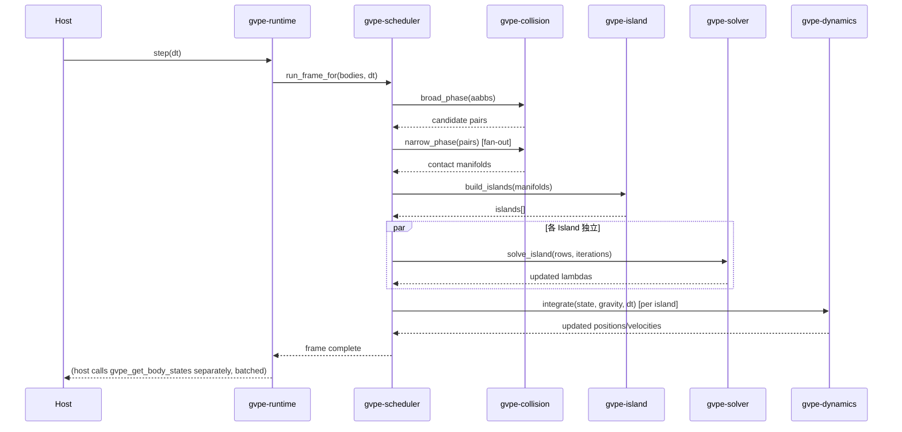

# GVPE — Detailed Design（詳細設計書）

## 0. 文档元数据

| 字段 | 取值 |
|---|---|
| 文档编号 | GVPE-DOC-17 |
| 文档类型 | 詳細設計書 |
| 版本 | v0.2（标准化重写版） |
| 状态 | Draft |
| 适用阶段 | MVP |
| 关联系统 | GVPE / gvpe-core, gvpe-memory, gvpe-shape, gvpe-collision, gvpe-dynamics, gvpe-constraint, gvpe-solver, gvpe-island, gvpe-scheduler, gvpe-runtime, gvpe-ffi, gvpe-graph, gvpe-compiler, gvpe-vector |
| 上游文档（输入基线） | `04_architecture.md`, `05_runtime_design.md`–`16_dependency_license.md`, `00_vision.md` §0.6 |
| 下游文档（被消费于） | `18_joints_ccd_design.md`, `19_softbody_xpbd_design.md`, `20_shape_advanced_design.md`, `21_graph_compiler_detailed_design.md`, `10_ffi_design.md` |
| 编写者 | — |
| 审批者 | — |

## 1. 修订历史

| 版本 | 日期 | 修改者 | 修改内容 |
|---|---|---|---|
| v0.1 | — | — | 初稿（原始版本） |
| v0.2 | 2026-08-19 | 标准化 pass | 转为 IPA 詳細設計書 格式；叙事中文化；保留全部技术内容；补充文档元数据、修订历史、术语定义、关联文档、审批签字等标准章节 |

## 2. 文档目的

本文档是 `00_vision.md` §0.6 标记为"待补"的下一层深度文档，为 MVP 关键 crate 提供具体的 struct、trait、算法定义——即「现在就要按这个写代码」的细节深度。非 MVP crate（`gvpe-graph`、`gvpe-vector`、`gvpe-compiler`、`gvpe-inference`、`gvpe-3dgs`）仅给出接口级细节，与 `01_requirements.md` §11 的范围行一致：现阶段深入这些 crate 的内部正是 `00_vision.md` §0.2 警告的"过早复杂化"。

约定：struct 字段表达的是设计意图，而非最终内存布局（padding/对齐调整属于实现阶段，除非另有说明）。每个小节结尾列出其满足的需求 ID。

## 3. 适用范围

- 适用于 GVPE MVP 阶段所有运行时 crate 的实现级详细设计。
- 不适用于非 MVP 子系统（`gvpe-graph`、`gvpe-vector`、`gvpe-compiler`、`gvpe-inference`、`gvpe-3dgs`）的内部实现——这些仅提供接口级说明，对应单独的设计文档（见 §11、§12）。
- 不适用于 GPU 后端的内部算法（`gvpe-gpu` 属于后续 Phase 范畴）。

## 4. 术语定义

| 术语 | 定义 |
|---|---|
| 物理知识图谱（Physics Knowledge Graph, PKG） | 描述物理实体、属性、关系的有向图结构，是 GVPE 数据建模的本体层 |
| 物理签名（Physics Signature） | 仿真状态的可计算特征向量，用于相似性检索与聚类 |
| 物理编译器（Physics Compiler） | 将图谱查询结果编译为 `PhysicsProfile` 的组件 |
| 世代索引（Generational Index） | 由 `index` + `generation` 组成的句柄，可检测 use-after-free |
| 接触流形（Contact Manifold） | 两个碰撞体之间一组相关接触点的集合 |
| 物理签名族（Physics Signature Family） | 一组结构相似的物理签名 |
| 编译器边界（Compiler Boundary） | Compiler 产物（`PhysicsProfile`）与 Runtime 之间的接口边界 |
| 顺序冲量（Sequential Impulse, SI） | 一种基于 PGS 的迭代约束求解方法 |
| 投影 Gauss-Seidel | Sequential Impulse 求解器中按行顺序更新 lambda 的迭代格式 |
| 物理岛（Physics Island） | 相互之间存在约束（接触/关节）而连通的一组刚体集合，可独立求解 |
| 任务 DAG（Job DAG） | 调度器内部表示帧内任务依赖关系的有向无环图 |
| 工作窃取（Work Stealing） | 线程从其他线程队列尾部偷取任务的负载均衡策略 |
| 零分配（Zero-Allocation） | 在热路径上不进行堆分配的运行时约束 |
| 零拷贝（Zero-Copy） | 数据传递时不进行内存复制的约束 |
| 高速缓存友好（Cache-Friendly） | 数据布局对 CPU 缓存行友好的设计取向 |
| 数据导向（Data-Oriented Design, DOD） | 以数据布局为核心的设计哲学 |
| 伪代码（Pseudocode） | 用类 Rust 语法表达算法逻辑，但不保证可直接编译的说明性代码 |
| 写入状态批（Write State Batch） | `write_state_batch` 函数：批量将 State 写入图谱存储 |
| 深度受限遍历（Depth-Bounded Traversal） | `depth_bounded_traversal`：设定最大深度的图遍历算法 |
| 帧草稿区（Frame Scratch） | 每帧重置的临时内存池，用于本帧内的临时分配 |

## 5. 模块详细设计

### 5.1 `gvpe-core` 模块

- 句柄类型：见正文 §1.1
- PhysicsProfile：见正文 §1.2
- RuntimeDescriptor：见正文 §1.3

### 5.2 `gvpe-memory` 模块

- Arena（帧草稿区）：见正文 §2.1
- Pool（固定大小复用）：见正文 §2.2
- Slab（带世代计数）：见正文 §2.3

### 5.3 `gvpe-shape` / `gvpe-collision` 模块

- 形状描述（MVP：Sphere/Box/Plane）：见正文 §3.1
- 宽阶段：SAP：见正文 §3.2
- 窄阶段：SAT：见正文 §3.3

### 5.4 `gvpe-dynamics` 模块

- 刚体状态（SoA 布局）：见正文 §4.1
- 积分（semi-implicit Euler）：见正文 §4.2

### 5.5 `gvpe-constraint` 模块

- ConstraintRow：见正文 §5.1
- 从接触流形构建约束行：见正文 §5.2

### 5.6 `gvpe-solver` 模块

- Sequential Impulse 完整算法：见正文 §6

### 5.7 `gvpe-island` 模块

- 连通分量（Union-Find）：见正文 §7.1
- 睡眠判定：见正文 §7.2

### 5.8 `gvpe-scheduler` 模块

- Job DAG 执行：见正文 §8.1

### 5.9 `gvpe-runtime` 模块

- 帧循环与生命周期：见正文 §9

### 5.10 `gvpe-ffi` 模块

- C ABI 实现骨架：见正文 §10.1

### 5.11 `gvpe-graph` / `gvpe-compiler`（接口级，MVP 范围外）

见正文 §11。

### 5.12 `gvpe-vector`（接口级，MVP 范围外）

见正文 §12。

### 5.13 错误模型

见正文 §13。

### 5.14 帧处理序列

见正文 §14。

## 6. 类与数据结构

主要数据结构（按 crate 组织）：

- `BodyHandle`、`ConstraintHandle`、`IslandHandle`（`gvpe-core` §1.1）
- `PhysicsProfile`、`SolverTypeId`、`PhysicsLodTag`（`gvpe-core` §1.2）
- `RuntimeDescriptor`、`BodySpec`（`gvpe-core` §1.3）
- `Arena`、`Pool<T>`、`Slab<T>`（`gvpe-memory` §2.1–§2.3）
- `ShapeDesc`、`Aabb`（`gvpe-shape` §3.1）
- `BodyStateSoA`（`gvpe-dynamics` §4.1）
- `ConstraintRow`、`ConstraintRowKind`（`gvpe-constraint` §5.1）
- `UnionFind`（`gvpe-island` §7.1）
- `Job`、`Scheduler`（`gvpe-scheduler` §8.1）
- `GvpeContext`（`gvpe-runtime` §9）
- `GraphStore`、`PhysicsCompiler`（`gvpe-graph` / `gvpe-compiler` §11）
- `SignatureExtractor`、`SimilaritySearch`（`gvpe-vector` §12）
- `InitError`、`SolverDivergence`、`GraphError`、`CompileError`（错误模型 §13）

## 7. 算法详解

- 宽阶段：SAP（`gvpe-collision` §3.2）
- 窄阶段：SAT（`gvpe-collision` §3.3）
- 积分：semi-implicit Euler（`gvpe-dynamics` §4.2）
- 求解：Sequential Impulse（`gvpe-solver` §6）
- 物理岛构建：Union-Find（`gvpe-island` §7.1）
- 睡眠判定：速度阈值+连续帧数（`gvpe-island` §7.2）
- Job DAG 调度（`gvpe-scheduler` §8.1）
- 帧 1 次的完整调用序列（§14）

## 8. 错误处理

- 详见正文 §13 错误模型表
- `InitError`：`GvpeContext::new` 失败时返回，描述 `RuntimeDescriptor` 不一致（NaN 质量、负 inertia 等）
- `SolverDivergence`：反迭代过程中 `lambda` 发散（NaN/Inf），将对应物理岛置为 Sleeping 推迟到下一帧（保守侧，避免崩溃）
- `GraphError`、`CompileError`：仅在 `gvpe-graph` / `gvpe-compiler` 内部传播，不到达 Runtime
- FFI 错误码：统一 `i32`，`0` 为成功，负值为错误类型（`GVPE_ERR_PANIC`、`GVPE_ERR_NULL_ARG`、`GVPE_ERR_INVALID_HANDLE` 等），字符串详情通过 `gvpe_last_error_message` 获取

## 9. 性能考量

- 数据布局：SoA（`gvpe-dynamics` §4.1），提升缓存命中率
- 内存管理：Arena（帧草稿，O(1) 重置）、Pool（固定大小复用）、Slab（带世代计数，零分配）
- 并行：物理岛间无锁并行（`gvpe-scheduler` §8.1，源自 §7.1 的不共享约束行性质）
- 宽阶段：SAP 选择方差最大的分离轴，前一帧顺序假设使 insertion sort 接近 O(n)
- 零分配：求解热路径不使用堆分配
- 性能预算：见 `14_performance_budget.md`

## 10. 测试考量

- 每个模块的算法（SAP、SAT、SI、Union-Find、睡眠判定、Job DAG）都需要独立单元测试
- 回归测试：Solver 收敛性、发散检测、睡眠/唤醒状态机、世代索引的 use-after-free 检测
- 帧序列集成测试：覆盖正文 §14 的完整调用顺序
- 性能回环测试（Round-Trip）：与 `15_testing_strategy.md` 保持一致，验证真实求解器运行结果，不依赖手编魔法数字

## 11. 关联需求

| 需求 ID | 中文描述 | 满足位置 |
|---|---|---|
| GVPE-FR-002 | 刚体动力学求解（含积分、约束求解、接触） | §3（碰撞）、§4（动力学）、§6（求解） |
| GVPE-FR-003 | 运行时与编译器的边界 | §1.2（PhysicsProfile）、§1.3（RuntimeDescriptor） |
| GVPE-FR-005 | FFI 边界与 panic 安全 | §10（gvpe-ffi） |
| GVPE-NFR-002 | 零分配/无锁竞争热路径 | §2（gvpe-memory）、§7（gvpe-island）、§8（gvpe-scheduler） |
| GVPE-NFR-003 | AC-02 范围内类型显式 | §1.2、§1.3 |
| `07号文書` §7.1/§7.3 | ConstraintRow 与摩擦约束 | §5、§6 |
| `07号文書` §7.4 | 物理岛与睡眠 | §7 |
| `09号文書` §9.1 | 物理岛睡眠 | §7.2 |
| `09号文書` §9.2/§9.3 | Job DAG 与无全局 Mutex | §8 |
| `10号文書` §10.2/§10.3 | FFI 实现与 panic 防护 | §10 |
| `12号文書` §12.4 | Field 抽象钩子 | §4.2 |

## 12. 关联文档

- 上游：`00_vision.md` §0.5/§0.6、`01_requirements.md` §11、`02_physics_ontology.md` §1/§4/§9、`03_graph_schema.md` §1.C、`04_architecture.md` §4.3/§4.4/§4.5/§4.9、`05_runtime_design.md` §5.1/§5.3/§5.4/§5.5、`06_collision_design.md` §6.4、`07_solver_design.md` §7.1/§7.2/§7.3/§7.4、`08_memory_design.md`、`09_scheduling_design.md`、`10_ffi_design.md`、`12_energy_wave_field_design.md` §12.4、`14_performance_budget.md`、`15_testing_strategy.md` §15.4/§15.6、`16_dependency_license.md`
- 下游：`18_joints_ccd_design.md`、`19_softbody_xpbd_design.md`、`20_shape_advanced_design.md`、`21_graph_compiler_detailed_design.md`
- 平行：`10_ffi_design.md`（FFI 边界测试承担 `#[repr(C)]` 完整保证）

## 13. 审批签字

| 角色 | 姓名 | 签字 | 日期 |
|---|---|---|---|
| 编写 | — | — | — |
| 校对 | — | — | — |
| 审批 | — | — | — |

---

## 14. 正文

### 目次

1. `gvpe-core`：句柄・PhysicsProfile・RuntimeDescriptor
2. `gvpe-memory`：分配器详细
3. `gvpe-shape` / `gvpe-collision`：形状与碰撞判定算法
4. `gvpe-dynamics`：刚体状态与积分
5. `gvpe-constraint`：ConstraintRow 及其构建
6. `gvpe-solver`：Sequential Impulse 详细算法
7. `gvpe-island`：连通分量与睡眠
8. `gvpe-scheduler`：Job DAG 执行详细
9. `gvpe-runtime`：帧循环与上下文生命周期
10. `gvpe-ffi`：C ABI 实现详细
11. `gvpe-graph` / `gvpe-compiler`（仅接口，MVP 范围外）
12. `gvpe-vector`（仅接口，MVP 范围外）
13. 错误模型
14. 处理序列（帧 1 次的完整调用顺序）

---

## 1. `gvpe-core`

### 1.1 句柄类型

```rust
#[derive(Clone, Copy, PartialEq, Eq, Hash)]
struct BodyHandle { index: u32, generation: u32 }   // generational index, use-after-free を検出

#[derive(Clone, Copy, PartialEq, Eq, Hash)]
struct ConstraintHandle { index: u32, generation: u32 }

#[derive(Clone, Copy, PartialEq, Eq, Hash)]
struct IslandHandle(u32);
```

`generation` 字段是「删除后对旧句柄的访问」的运行时检测用世代计数器（`gvpe-dynamics` §4.1 的池在删除 body 时自增）。

### 1.2 PhysicsProfile（Compiler → Runtime 的唯一传递形式）

```rust
#[repr(C)]  // POD, gvpe-ffi でそのまま利用可能
struct PhysicsProfile {
    mass: f32, density: f32, inertia: [f32; 9],       // 3x3 テンソル, 平坦化
    friction: f32, restitution: f32, damping_linear: f32, damping_angular: f32,
    stiffness: f32, compliance: f32, viscosity: f32,
    solver_type: SolverTypeId, solver_iterations: u16,
    collision_profile: CollisionProfileId, approximation_level: PhysicsLodTag,
}

#[repr(u8)]
enum SolverTypeId { SequentialImpulse = 0, Xpbd = 1 /* reserved, unused MVP */ }

#[repr(u8)]
enum PhysicsLodTag { Lod0Full = 0, Lod1Reduced, Lod2Approximation, Lod3CachedBehavior, Lod4Static }
```

`#[repr(C)]` 在编译期以接近但非完整的形式保证了 `04_architecture.md` §4.4「Runtime 仅接收 POD」的约束（完整保证由 `10_ffi_design.md` 的 FFI 边界测试承担）。

### 1.3 RuntimeDescriptor

```rust
struct RuntimeDescriptor {
    bodies: Vec<BodySpec>,       // 初期配置・形状・PhysicsProfile 参照
    gravity: [f32; 3],
    determinism_mode: DeterminismMode,   // 05号文書 §5.3
    thread_pool_size: Option<u32>,       // None = ホストのスレッドプールに委譲（09号文書）
}

struct BodySpec {
    shape: ShapeDesc,             // 3号 gvpe-shape 参照
    initial_transform: Transform,
    profile: PhysicsProfile,
    is_static: bool,
}
```

对应需求：GVPE-FR-003, GVPE-NFR-003（AC-02 的对象范围以类型显式表达）。

---

## 2. `gvpe-memory`

### 2.1 Arena（帧草稿区）

```rust
struct Arena { buf: Box<[u8]>, cursor: AtomicUsize }

impl Arena {
    fn alloc<T>(&self, val: T) -> &mut T {
        let offset = self.cursor.fetch_add(align_up(size_of::<T>()), Ordering::Relaxed);
        assert!(offset + size_of::<T>() <= self.buf.len(), "arena overflow: grow preallocation");
        // 生ポインタ経由で書き込み, 'frame ライフタイムの参照として返す（unsafe, 内部実装のみ）
        unsafe { write_and_borrow(&self.buf, offset, val) }
    }
    fn reset(&mut self) { *self.cursor.get_mut() = 0; }   // O(1), 解放なし
}
```

`alloc` 通过 `fetch_add` 在线程间无锁地分配互不冲突的区域——`09号文書` §9.3 的线程局部 `FrameScratch` 各自持有独立的 `Arena` 实例，因此这个 `AtomicUsize` 是「单线程从多个任务访问同一 Arena」情况下的保险，通常不会发生实际竞争。

### 2.2 Pool（`ConstraintRow` 等固定大小复用）

```rust
struct Pool<T> { slots: Vec<Option<T>>, free_list: Vec<u32> }

impl<T> Pool<T> {
    fn acquire(&mut self, val: T) -> u32 {
        if let Some(idx) = self.free_list.pop() { self.slots[idx as usize] = Some(val); idx }
        else { self.slots.push(Some(val)); (self.slots.len() - 1) as u32 }
    }
    fn release(&mut self, idx: u32) { self.slots[idx as usize] = None; self.free_list.push(idx); }
}
```

### 2.3 Slab（body 存储，带世代计数器）

```rust
struct Slab<T> { data: Vec<T>, generation: Vec<u32>, free_list: Vec<u32> }
// BodyHandle.index は data のインデックス, BodyHandle.generation は generation[index] と照合
```

对应需求：GVPE-NFR-002。

---

## 3. `gvpe-shape` / `gvpe-collision`

### 3.1 形状描述（MVP：Sphere/Box/Plane）

```rust
enum ShapeDesc { Sphere { radius: f32 }, Box3 { half_extents: [f32; 3] }, Plane { normal: [f32; 3], offset: f32 } }

struct Aabb { min: [f32; 3], max: [f32; 3] }
```

### 3.2 宽阶段：SAP（Sweep and Prune）

```rust
fn broad_phase_sap(aabbs: &[Aabb], axis: usize, scratch: &Arena) -> Vec<(u32, u32)> {
    // 1. 各 AABB の axis 軸最小値でソート（前フレームの順序に近いことを利用し insertion sort）
    // 2. アクティブ区間をスイープしながら AABB の重なりを検出
    // 3. 重なりペアを (index_a, index_b) として出力（a < b で正規化, 重複排除）
    let mut sorted: &mut [u32] = scratch.alloc_slice_from(0..aabbs.len() as u32);
    insertion_sort_by_key(sorted, |&i| aabbs[i as usize].min[axis]);
    let mut pairs = Vec::new();
    let mut active: Vec<u32> = Vec::new();
    for &i in sorted.iter() {
        active.retain(|&j| aabbs[j as usize].max[axis] >= aabbs[i as usize].min[axis]);
        for &j in &active {
            if aabb_overlap(&aabbs[i as usize], &aabbs[j as usize]) { pairs.push((j.min(i), j.max(i))); }
        }
        active.push(i);
    }
    pairs
}
```

`axis` 每帧选择方差最大的轴（分离轴方差最大＝剪枝效果最佳）。假设与前一帧顺序接近的 insertion sort 在运动相干性高的场景下接近 O(n)。

### 3.3 窄阶段：SAT（Box-Box / Box-Plane / Sphere-Box）

```rust
fn narrow_phase_sat(a: &ShapeDesc, xf_a: &Transform, b: &ShapeDesc, xf_b: &Transform)
    -> Option<ContactManifold>
{
    let axes = collect_separating_axes(a, xf_a, b, xf_b);   // 面法線 + エッジ外積（Box-Box）
    let mut min_overlap = f32::INFINITY;
    let mut best_axis = None;
    for axis in axes {
        let (min_a, max_a) = project(a, xf_a, axis);
        let (min_b, max_b) = project(b, xf_b, axis);
        let overlap = min_a.max(min_b) - max_a.min(max_b);
        if overlap > 0.0 { return None; }               // 分離軸発見 → 非接触
        if -overlap < min_overlap { min_overlap = -overlap; best_axis = Some(axis); }
    }
    Some(build_manifold_from_axis(a, xf_a, b, xf_b, best_axis?, min_overlap))
}
```

`ContactManifold` / `ContactPoint` 的类型定义见 `06_collision_design.md` §6.4（本节不再重复）。GJK / EPA 在 Convex Hull 支持时（post-MVP）作为独立函数加入，本 SAT 实现保持不动。

对应需求：GVPE-FR-002。

---

## 4. `gvpe-dynamics`

### 4.1 Body 状态（SoA 布局，遵循 `05号文書` §5.1）

```rust
struct BodyStateSoA {
    position: Vec<[f32; 3]>, rotation: Vec<[f32; 4]>,           // Hot
    linear_velocity: Vec<[f32; 3]>, angular_velocity: Vec<[f32; 3]>,  // Hot
    inv_mass: Vec<f32>, inv_inertia: Vec<[f32; 9]>,             // Warm
    sleeping: Vec<bool>,                                          // Warm
    generation: Vec<u32>,                                         // Cold（Slab §2.3 と共有）
}
```

### 4.2 积分（semi-implicit Euler，参考实现）

```rust
fn integrate(state: &mut BodyStateSoA, gravity: [f32; 3], dt: f32) {
    for i in 0..state.position.len() {
        if state.sleeping[i] || state.inv_mass[i] == 0.0 { continue; }  // 静的 or 睡眠中はスキップ
        let accel = scale(gravity, 1.0);  // Field 抽象化フック（12号文書 §12.4）：定数場を "サンプル" する形
        state.linear_velocity[i] = add(state.linear_velocity[i], scale(accel, dt));
        state.position[i] = add(state.position[i], scale(state.linear_velocity[i], dt));
        state.rotation[i] = integrate_quat(state.rotation[i], state.angular_velocity[i], dt);
    }
}
```

将 `gravity` 不直接相加而作为「均匀场的采样」处理，符合 `12_energy_wave_field_design.md` §12.4 的要求——MVP 时代价不变，但未来替换为非均匀 Field 时无需修改此函数签名。

对应需求：GVPE-FR-002, `12号文書` §12.4。

---

## 5. `gvpe-constraint`

### 5.1 ConstraintRow（将 `07号文書` §7.1 的类型展开到实现级）

```rust
struct ConstraintRow {
    body_a: BodyHandle, body_b: BodyHandle,
    jacobian_a: [f32; 6], jacobian_b: [f32; 6],   // [linear(3), angular(3)]
    bias: f32, compliance: f32,
    lambda: f32,                                    // 累積インパルス（ウォームスタート用）
    lower: f32, upper: f32,
    kind: ConstraintRowKind,
}
enum ConstraintRowKind { ContactNormal, ContactFriction { normal_row: u32 }, /* Joint 系は post-MVP */ }
```

### 5.2 从接触流形构建约束行

```rust
fn build_rows_from_manifold(manifold: &ContactManifold, friction_coeff: f32,
                              prev_lambdas: &HashMap<ContactKey, f32>) -> Vec<ConstraintRow> {
    let mut rows = Vec::with_capacity(manifold.points.len() * 3);   // normal + 2 friction tangents
    for p in &manifold.points {
        let normal_row = ConstraintRow {
            body_a: manifold.body_a, body_b: manifold.body_b,
            jacobian_a: jacobian_for_normal(p, manifold.body_a),
            jacobian_b: jacobian_for_normal(p, manifold.body_b),
            bias: baumgarte_bias(p.penetration),   // ペネトレーション補正（Baumgarte 安定化）
            compliance: 0.0,   // Gen1 は剛体接触, compliance=0（XPBD 移行時に非ゼロ値を使う, 07号§7.2）
            lambda: prev_lambdas.get(&p.key()).copied().unwrap_or(0.0),   // ウォームスタート
            lower: 0.0, upper: f32::INFINITY,
            kind: ConstraintRowKind::ContactNormal,
        };
        let idx = rows.len() as u32;
        rows.push(normal_row);
        rows.push(build_friction_row(p, manifold, idx, friction_coeff));  // upper/lower は normal_row.lambda に依存, 毎反復更新
    }
    rows
}
```

`ContactKey`（与前一帧的对应点识别）由接触点的 (body pair, 特征 ID) 构建——只要流形的点对应不变，warm-start 即生效。

对应需求：GVPE-FR-002, `07号文書` §7.1/§7.3。

---

## 6. `gvpe-solver`：Sequential Impulse 完整算法

```rust
fn solve_island(rows: &mut [ConstraintRow], state: &mut BodyStateSoA, iterations: u16) {
    // ウォームスタート：前フレームの lambda を初期インパルスとして即時適用
    for row in rows.iter() { apply_impulse(state, row, row.lambda); }

    for _ in 0..iterations {
        for i in 0..rows.len() {
            let row = &rows[i];
            let jv = relative_velocity_along_jacobian(state, row);
            let mut delta_lambda = -(jv + row.bias) / effective_mass(state, row);
            delta_lambda /= 1.0 + row.compliance;   // XPBD 互換のコンプライアンス項（Gen1 は 0）

            let (lower, upper) = resolve_bounds(row, rows);  // friction row は対応する normal_row.lambda を参照
            let new_lambda = (rows[i].lambda + delta_lambda).clamp(lower, upper);
            let applied = new_lambda - rows[i].lambda;
            rows[i].lambda = new_lambda;

            apply_impulse(state, &rows[i], applied);   // 即座に速度へ反映（Gauss-Seidel, Jacobi ではない）
        }
    }
}
```

`resolve_bounds` 在每次反迭代中重算摩擦行的 `upper = friction_coeff * normal_row.lambda`（库仑摩擦锥的矩形近似，`07号文書` §7.3）——normal 行的 lambda 在反迭代中变化，摩擦行的边界随之动态跟随。

对应需求：GVPE-FR-002, `07号文書` §7.1。

---

## 7. `gvpe-island`

### 7.1 连通分量（Union-Find，作用于 Runtime Constraint Graph）

```rust
struct UnionFind { parent: Vec<u32>, rank: Vec<u8> }
impl UnionFind {
    fn find(&mut self, x: u32) -> u32 { /* path compression */ }
    fn union(&mut self, a: u32, b: u32) { /* union by rank */ }
}

fn build_islands(bodies: &[BodyHandle], contact_pairs: &[(u32, u32)]) -> Vec<Island> {
    let mut uf = UnionFind::new(bodies.len());
    for &(a, b) in contact_pairs { uf.union(a, b); }
    group_by_root(&mut uf, bodies)   // root ごとに Island を構築
}
```

静态 body（`inv_mass == 0`）不纳入 Union-Find——防止无关联的两个动态簇通过静态 body 合并为单个物理岛（若允许，将破坏并行粒度）。

### 7.2 睡眠判定

```rust
fn update_sleep(island: &mut Island, state: &mut BodyStateSoA, threshold: f32, frames_required: u16) {
    let all_below = island.bodies.iter().all(|&h| {
        speed_sq(state, h) < threshold * threshold
    });
    island.quiet_frames = if all_below { island.quiet_frames + 1 } else { 0 };
    if island.quiet_frames >= frames_required {
        for &h in &island.bodies { state.sleeping[h.index as usize] = true; }
    }
}
```

对应需求：`07号文書` §7.4, `09号文書` §9.1。

---

## 8. `gvpe-scheduler`

### 8.1 Job DAG 执行（`09号文書` §9.2 的具体化）

```rust
struct Job { func: Box<dyn FnOnce() + Send>, dependents: Vec<JobId>, remaining_deps: AtomicU32 }

struct Scheduler { jobs: Vec<Job>, ready_queue: WorkStealingQueue<JobId>, pool: ThreadPool }

impl Scheduler {
    fn run_frame(&mut self) {
        // Execution Graph（03号文書 §1.C）をこの関数呼び出しの並び自体が表現する
        self.dispatch(self.job_broad_phase());
        // narrow phase はブロードフェーズ結果のペア数だけ fan-out
        let pairs = self.wait(self.job_broad_phase());
        for chunk in pairs.chunks(NARROW_PHASE_CHUNK_SIZE) { self.dispatch(self.job_narrow_phase(chunk)); }
        self.wait_all_narrow_phase();
        self.dispatch(self.job_island_build());
        let islands = self.wait(self.job_island_build());
        for island in &islands { self.dispatch(self.job_solve_island(island)); }   // island 間はロック不要
        self.wait_all_solve();
        for island in &islands { self.dispatch(self.job_integrate(island)); }
        self.wait_all_integrate();
    }
}
```

`job_solve_island` 之间不存在锁，原因在于 `gvpe-island` §7.1 保证物理岛之间不共享约束行——这是 `09号文書` §9.3「避免全局 Mutex」目标的直接实现依据。

对应需求：`09号文書` §9.2/§9.3, GVPE-NFR-002（无锁竞争）。

---

## 9. `gvpe-runtime`：帧循环与生命周期

```rust
struct GvpeContext {
    bodies: Slab<BodyRecord>,
    scheduler: Scheduler,
    determinism_mode: DeterminismMode,
    frame_scratch: ThreadLocal<Arena>,   // スレッドごとに独立（08号文書 §2.1 の注記どおり）
}

impl GvpeContext {
    fn new(desc: RuntimeDescriptor) -> Result<Self, InitError> {
        // desc.bodies を Slab へロード, Scheduler をスレッド数で初期化
        // グローバル状態への書き込みは一切ない（05号文書 §5.4 の禁止事項）
    }

    fn step(&mut self, dt: f32) {
        for arena in self.frame_scratch.iter_mut() { arena.reset(); }   // O(1) x スレッド数
        self.scheduler.run_frame_for(&mut self.bodies, dt, self.determinism_mode);
    }
}
```

`GvpeContext` 在 `Drop` 实现中释放线程池与 Arena 的预留空间——为避免反复创建成本（线程池启动），同一进程内多实例场景下允许宿主侧共享线程池（`RuntimeDescriptor.thread_pool_size = None` 的情形，`04号文書` §4.9）。

对应需求：`05号文書` §5.4, GVPE-NFR（禁止全局状态）。

---

## 10. `gvpe-ffi`

### 10.1 实现骨架（`10号文書` §10.2/§10.3 的 Rust 侧实现）

```rust
#[no_mangle]
pub extern "C" fn gvpe_context_create(desc: *const GvpeRuntimeDescriptor) -> *mut GvpeContext {
    std::panic::catch_unwind(|| {
        if desc.is_null() { return std::ptr::null_mut(); }
        let rust_desc = unsafe { convert_ffi_descriptor(&*desc) };
        match GvpeContext::new(rust_desc) {
            Ok(ctx) => Box::into_raw(Box::new(ctx)),
            Err(_) => std::ptr::null_mut(),
        }
    }).unwrap_or(std::ptr::null_mut())
}

#[no_mangle]
pub extern "C" fn gvpe_get_body_states(ctx: *mut GvpeContext, handles: *const u32, count: usize,
                                         out: *mut GvpeBodyState) -> i32 {
    std::panic::catch_unwind(|| {
        let ctx = unsafe { &*ctx };
        let handles = unsafe { std::slice::from_raw_parts(handles, count) };
        let out = unsafe { std::slice::from_raw_parts_mut(out, count) };
        for (i, &h) in handles.iter().enumerate() {
            out[i] = ctx.body_state_ffi(BodyHandle::from_raw(h))
                        .unwrap_or(GvpeBodyState::INVALID);   // 個別に失敗しても全体は続行, 呼び出し側が検査
        }
        0
    }).unwrap_or(GVPE_ERR_PANIC)
}
```

所有 `extern "C"` 函数都被 `catch_unwind` 包裹（`10号文書` §10.3 的强制要求的代码化）。`null` 参数检查在每个函数开头执行，尽可能安全地拒绝 C 侧未初始化指针的传入。

对应需求：GVPE-FR-005, `10号文書` §10.3。

---

## 11. `gvpe-graph` / `gvpe-compiler`（仅接口，MVP 范围外）

```rust
trait GraphStore {
    fn query_profile_inputs(&self, entity: EntityId) -> Result<GraphQueryResult, GraphError>;
}

trait PhysicsCompiler {
    fn compile(&self, input: GraphQueryResult) -> Result<PhysicsProfile, CompileError>;
}
```

`GraphStore` 的具体内部数据模型实现见 `03号文書`，但其内部实现（包括后端 DB 选型）需待 `16号文書` 的许可证审查完成才能确定——本节仅固定接口边界。`CompileError` 表达「Graph 侧数据不足/矛盾」，与 Runtime 侧的 `InitError` 是不同类型（以类型分离 `04号文書` §4.4 的边界）。

## 12. `gvpe-vector`（仅接口，MVP 范围外）

```rust
trait SignatureExtractor {
    fn extract(&self, state: &SimulationStateSnapshot) -> PhysicsSignature;   // 11号文書 §11.1
}
trait SimilaritySearch {
    fn search(&self, query: &KnownPhysicsSignature, top_n: usize) -> Vec<RetrievalCandidate>;
}
```

实现细节（编码器、ANN 索引技术）按 `11号文書` §11.5 方针尚未确定——本节仅固定「可独立于 Runtime 被调用」的边界。

---

## 13. 错误模型

| 错误类型 | 发生位置 | 处理方式 |
|---|---|---|
| `InitError` | `GvpeContext::new` | `RuntimeDescriptor` 不一致（NaN 质量、负 inertia 等）。作为创建失败立即返回 |
| `SolverDivergence` | `gvpe-solver` | 反迭代中检测到 `lambda` 发散（NaN/Inf），将对应物理岛置为 `Sleeping` 不带入下一帧（崩溃优先于安全侧） |
| `GraphError` | `gvpe-graph`（非 MVP） | 传播至 Compiler 调用方，不到达 Runtime |
| `CompileError` | `gvpe-compiler`（非 MVP） | 同上 |
| FFI 错误码 | `gvpe-ffi` | 全部为 `i32`，`0` 为成功，负值为错误类型（`GVPE_ERR_PANIC`、`GVPE_ERR_NULL_ARG`、`GVPE_ERR_INVALID_HANDLE` 等）。字符串详情通过 `gvpe_last_error_message`（`10号文書` §10.2 的类型）获取 |

对应需求：`14号文書` §14.4（与性能回归相同，发散也作为「bug 处理」的一致性）。

---

## 14. 处理序列（帧 1 次）



此序列是 `05号文書` §5.5 的 Execution Graph 的直接实现，符合 `03号文書` §1.C「Execution Graph 不含物理语义」的约束——图中的任何步骤均不引用 `gvpe-graph` / `gvpe-vector`。

对应需求：`04号文書` §4.3（依赖方向的运行时证据），AC-01/AC-02 的验证对象范围。
