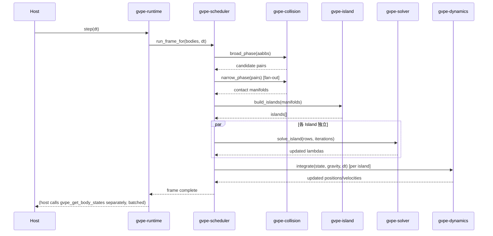

# GVPE — Detailed Design（詳細設計）

Input baseline: `04_architecture.md`, `05_runtime_design.md`–`16_dependency_license.md`. This is the
next depth tier `00_vision.md` §0.6 flagged as owed — concrete struct/trait/algorithm definitions
for the MVP-critical crates. Non-MVP crates (`gvpe-graph`, `gvpe-vector`, `gvpe-compiler`,
`gvpe-inference`, `gvpe-3dgs`) get interface-level detail only, consistent with `01_requirements.md`
§11's scope line — deepening their internals now would be exactly the kind of premature complexity
`00_vision.md` §0.2 warns against.

Convention: struct fields express design intent, not final layout (padding/alignment tuning is an
implementation-phase concern unless called out). Each section ends with the requirement IDs it
satisfies.

---

## 目次

1. `gvpe-core`：ハンドル・PhysicsProfile・RuntimeDescriptor
2. `gvpe-memory`：アロケータ詳細
3. `gvpe-shape` / `gvpe-collision`：形状と衝突判定アルゴリズム
4. `gvpe-dynamics`：剛体状態と積分
5. `gvpe-constraint`：ConstraintRow とその構築
6. `gvpe-solver`：Sequential Impulse 詳細アルゴリズム
7. `gvpe-island`：連結成分とスリープ
8. `gvpe-scheduler`：Job DAG 実行詳細
9. `gvpe-runtime`：フレームループとコンテキストライフサイクル
10. `gvpe-ffi`：C ABI 実装詳細
11. `gvpe-graph` / `gvpe-compiler`（インターフェースのみ、MVP 非対象）
12. `gvpe-vector`（インターフェースのみ、MVP 非対象）
13. エラーモデル
14. 処理シーケンス（フレーム1回分の完全な呼び出し順）

---

## 1. `gvpe-core`

### 1.1 ハンドル型

```rust
#[derive(Clone, Copy, PartialEq, Eq, Hash)]
struct BodyHandle { index: u32, generation: u32 }   // generational index, use-after-free を検出

#[derive(Clone, Copy, PartialEq, Eq, Hash)]
struct ConstraintHandle { index: u32, generation: u32 }

#[derive(Clone, Copy, PartialEq, Eq, Hash)]
struct IslandHandle(u32);
```
`generation` フィールドは「削除済みボディへの古い Handle アクセス」を実行時に検出するための
世代カウンタ（`gvpe-dynamics` §4.1 のプールがボディ削除時にインクリメントする）。

### 1.2 PhysicsProfile（Compiler → Runtime の唯一の受け渡し形）

```rust
#[repr(C)]  // POD、gvpe-ffi でそのまま利用可能
struct PhysicsProfile {
    mass: f32, density: f32, inertia: [f32; 9],       // 3x3 テンソル、平坦化
    friction: f32, restitution: f32, damping_linear: f32, damping_angular: f32,
    stiffness: f32, compliance: f32, viscosity: f32,
    solver_type: SolverTypeId, solver_iterations: u16,
    collision_profile: CollisionProfileId, approximation_level: PhysicsLodTag,
}

#[repr(u8)]
enum SolverTypeId { SequentialImpulse = 0, Xpbd = 1 /* reserved, unused MVP */ }

#[repr(u8)]
enum PhysicsLodTag { Lod0Full = 0, Lod1Reduced, Lod2Approximation, Lod3CachedBehavior, Lod4Static }
```
`#[repr(C)]` は `04_architecture.md` §4.4 の「Runtime は POD のみ受け取る」制約をコンパイル時に
近い形で担保する（完全な保証は `10_ffi_design.md` の FFI 境界テストが担う）。

### 1.3 RuntimeDescriptor

```rust
struct RuntimeDescriptor {
    bodies: Vec<BodySpec>,       // 初期配置・形状・PhysicsProfile 参照
    gravity: [f32; 3],
    determinism_mode: DeterminismMode,   // 05号文書 §5.3
    thread_pool_size: Option<u32>,       // None = ホストのスレッドプールに委譲（09号文書）
}

struct BodySpec {
    shape: ShapeDesc,             // 3号 gvpe-shape 参照
    initial_transform: Transform,
    profile: PhysicsProfile,
    is_static: bool,
}
```

対応需求：GVPE-FR-003, GVPE-NFR-003（AC-02 の対象範囲を型で明示）。

---

## 2. `gvpe-memory`

### 2.1 Arena（フレームスクラッチ）

```rust
struct Arena { buf: Box<[u8]>, cursor: AtomicUsize }

impl Arena {
    fn alloc<T>(&self, val: T) -> &mut T {
        let offset = self.cursor.fetch_add(align_up(size_of::<T>()), Ordering::Relaxed);
        assert!(offset + size_of::<T>() <= self.buf.len(), "arena overflow: grow preallocation");
        // 生ポインタ経由で書き込み、'frame ライフタイムの参照として返す（unsafe、内部実装のみ）
        unsafe { write_and_borrow(&self.buf, offset, val) }
    }
    fn reset(&mut self) { *self.cursor.get_mut() = 0; }   // O(1)、解放なし
}
```
`alloc` はスレッド間で `fetch_add` によりロックフリーに競合しない領域を割り当てる——`09号文書`
§9.3 のスレッドローカル `FrameScratch` はそれぞれ独立した `Arena` インスタンスを持つため、この
`AtomicUsize` は「1 スレッドが複数ジョブから同じ Arena を使う」場合の保険であり、通常は競合しない。

### 2.2 Pool（`ConstraintRow` 等の固定サイズ再利用）

```rust
struct Pool<T> { slots: Vec<Option<T>>, free_list: Vec<u32> }

impl<T> Pool<T> {
    fn acquire(&mut self, val: T) -> u32 {
        if let Some(idx) = self.free_list.pop() { self.slots[idx as usize] = Some(val); idx }
        else { self.slots.push(Some(val)); (self.slots.len() - 1) as u32 }
    }
    fn release(&mut self, idx: u32) { self.slots[idx as usize] = None; self.free_list.push(idx); }
}
```

### 2.3 Slab（ボディ格納、世代カウンタ対応）

```rust
struct Slab<T> { data: Vec<T>, generation: Vec<u32>, free_list: Vec<u32> }
// BodyHandle.index は data のインデックス、BodyHandle.generation は generation[index] と照合
```

対応需求：GVPE-NFR-002。

---

## 3. `gvpe-shape` / `gvpe-collision`

### 3.1 形状記述（MVP: Sphere/Box/Plane）

```rust
enum ShapeDesc { Sphere { radius: f32 }, Box3 { half_extents: [f32; 3] }, Plane { normal: [f32; 3], offset: f32 } }

struct Aabb { min: [f32; 3], max: [f32; 3] }
```

### 3.2 ブロードフェーズ：SAP（Sweep and Prune）

```rust
fn broad_phase_sap(aabbs: &[Aabb], axis: usize, scratch: &Arena) -> Vec<(u32, u32)> {
    // 1. 各 AABB の axis 軸最小値でソート（前フレームの順序に近いことを利用し insertion sort）
    // 2. アクティブ区間をスイープしながら AABB の重なりを検出
    // 3. 重なりペアを (index_a, index_b) として出力（a < b で正規化、重複排除）
    let mut sorted: &mut [u32] = scratch.alloc_slice_from(0..aabbs.len() as u32);
    insertion_sort_by_key(sorted, |&i| aabbs[i as usize].min[axis]);
    let mut pairs = Vec::new();
    let mut active: Vec<u32> = Vec::new();
    for &i in sorted.iter() {
        active.retain(|&j| aabbs[j as usize].max[axis] >= aabbs[i as usize].min[axis]);
        for &j in &active {
            if aabb_overlap(&aabbs[i as usize], &aabbs[j as usize]) { pairs.push((j.min(i), j.max(i))); }
        }
        active.push(i);
    }
    pairs
}
```
`axis` は分散が最大の軸を毎フレーム選択（分離軸の分散が最大＝最も足切り効果が高い）。前フレーム
とほぼ同じ順序であることを仮定した insertion sort は、コヒーレントな動きの下で O(n) に近い。

### 3.3 ナローフェーズ：SAT（Box-Box / Box-Plane / Sphere-Box）

```rust
fn narrow_phase_sat(a: &ShapeDesc, xf_a: &Transform, b: &ShapeDesc, xf_b: &Transform)
    -> Option<ContactManifold>
{
    let axes = collect_separating_axes(a, xf_a, b, xf_b);   // 面法線 + エッジ外積（Box-Box）
    let mut min_overlap = f32::INFINITY;
    let mut best_axis = None;
    for axis in axes {
        let (min_a, max_a) = project(a, xf_a, axis);
        let (min_b, max_b) = project(b, xf_b, axis);
        let overlap = min_a.max(min_b) - max_a.min(max_b);
        if overlap > 0.0 { return None; }               // 分離軸発見 → 非接触
        if -overlap < min_overlap { min_overlap = -overlap; best_axis = Some(axis); }
    }
    Some(build_manifold_from_axis(a, xf_a, b, xf_b, best_axis?, min_overlap))
}
```
`ContactManifold`/`ContactPoint` の型定義は `06_collision_design.md` §6.4 を参照（本節では再掲しな
い）。GJK/EPA は Convex Hull 対応時（post-MVP）に別関数として追加、この SAT 実装には手を入れない。

対応需求：GVPE-FR-002。

---

## 4. `gvpe-dynamics`

### 4.1 ボディ状態（SoA レイアウト、`05号文書` §5.1 準拠）

```rust
struct BodyStateSoA {
    position: Vec<[f32; 3]>, rotation: Vec<[f32; 4]>,           // Hot
    linear_velocity: Vec<[f32; 3]>, angular_velocity: Vec<[f32; 3]>,  // Hot
    inv_mass: Vec<f32>, inv_inertia: Vec<[f32; 9]>,             // Warm
    sleeping: Vec<bool>,                                          // Warm
    generation: Vec<u32>,                                         // Cold（Slab §2.3 と共有）
}
```

### 4.2 積分（semi-implicit Euler、reference 実装）

```rust
fn integrate(state: &mut BodyStateSoA, gravity: [f32; 3], dt: f32) {
    for i in 0..state.position.len() {
        if state.sleeping[i] || state.inv_mass[i] == 0.0 { continue; }  // 静的 or 睡眠中はスキップ
        let accel = scale(gravity, 1.0);  // Field 抽象化フック（12号文書 §12.4）：定数場を "サンプル" する形
        state.linear_velocity[i] = add(state.linear_velocity[i], scale(accel, dt));
        state.position[i] = add(state.position[i], scale(state.linear_velocity[i], dt));
        state.rotation[i] = integrate_quat(state.rotation[i], state.angular_velocity[i], dt);
    }
}
```
`gravity` を直接加算せず「一様場のサンプル」として扱っているのは `12_energy_wave_field_design.md`
§12.4 の要求どおり——MVP のコストは変わらないが、将来の非一様 Field への置き換えがこの関数のシグ
ネチャ変更なしで可能になる。

対応需求：GVPE-FR-002, `12号文書` §12.4。

---

## 5. `gvpe-constraint`

### 5.1 ConstraintRow（`07号文書` §7.1 の型を実装レベルまで展開）

```rust
struct ConstraintRow {
    body_a: BodyHandle, body_b: BodyHandle,
    jacobian_a: [f32; 6], jacobian_b: [f32; 6],   // [linear(3), angular(3)]
    bias: f32, compliance: f32,
    lambda: f32,                                    // 累積インパルス（ウォームスタート用）
    lower: f32, upper: f32,
    kind: ConstraintRowKind,
}
enum ConstraintRowKind { ContactNormal, ContactFriction { normal_row: u32 }, /* Joint 系は post-MVP */ }
```

### 5.2 マニフォールドからの行構築

```rust
fn build_rows_from_manifold(manifold: &ContactManifold, friction_coeff: f32,
                              prev_lambdas: &HashMap<ContactKey, f32>) -> Vec<ConstraintRow> {
    let mut rows = Vec::with_capacity(manifold.points.len() * 3);   // normal + 2 friction tangents
    for p in &manifold.points {
        let normal_row = ConstraintRow {
            body_a: manifold.body_a, body_b: manifold.body_b,
            jacobian_a: jacobian_for_normal(p, manifold.body_a),
            jacobian_b: jacobian_for_normal(p, manifold.body_b),
            bias: baumgarte_bias(p.penetration),   // ペネトレーション補正（Baumgarte 安定化）
            compliance: 0.0,   // Gen1 は剛体接触、compliance=0（XPBD 移行時に非ゼロ値を使う、07号§7.2）
            lambda: prev_lambdas.get(&p.key()).copied().unwrap_or(0.0),   // ウォームスタート
            lower: 0.0, upper: f32::INFINITY,
            kind: ConstraintRowKind::ContactNormal,
        };
        let idx = rows.len() as u32;
        rows.push(normal_row);
        rows.push(build_friction_row(p, manifold, idx, friction_coeff));  // upper/lower は normal_row.lambda に依存、毎反復更新
    }
    rows
}
```
`ContactKey`（前フレームとの対応点特定）は接触点の (body pair, 特徴 ID) から構築——マニフォール
ドの点対応が変わらない限りウォームスタートが効く。

対応需求：GVPE-FR-002, `07号文書` §7.1/§7.3。

---

## 6. `gvpe-solver`：Sequential Impulse 完全アルゴリズム

```rust
fn solve_island(rows: &mut [ConstraintRow], state: &mut BodyStateSoA, iterations: u16) {
    // ウォームスタート：前フレームの lambda を初期インパルスとして即時適用
    for row in rows.iter() { apply_impulse(state, row, row.lambda); }

    for _ in 0..iterations {
        for i in 0..rows.len() {
            let row = &rows[i];
            let jv = relative_velocity_along_jacobian(state, row);
            let mut delta_lambda = -(jv + row.bias) / effective_mass(state, row);
            delta_lambda /= 1.0 + row.compliance;   // XPBD 互換のコンプライアンス項（Gen1 は 0）

            let (lower, upper) = resolve_bounds(row, rows);  // friction row は対応する normal_row.lambda を参照
            let new_lambda = (rows[i].lambda + delta_lambda).clamp(lower, upper);
            let applied = new_lambda - rows[i].lambda;
            rows[i].lambda = new_lambda;

            apply_impulse(state, &rows[i], applied);   // 即座に速度へ反映（Gauss-Seidel、Jacobi ではない）
        }
    }
}
```
`resolve_bounds` は摩擦行の `upper = friction_coeff * normal_row.lambda`（クーロン摩擦円錐の矩形
近似、`07号文書` §7.3）を毎反復で再計算する——normal 行の lambda が反復中に変化するため、摩擦行
の境界も動的に追従する。

対応需求：GVPE-FR-002, `07号文書` §7.1。

---

## 7. `gvpe-island`

### 7.1 連結成分（Union-Find、Runtime Constraint Graph 上）

```rust
struct UnionFind { parent: Vec<u32>, rank: Vec<u8> }
impl UnionFind {
    fn find(&mut self, x: u32) -> u32 { /* path compression */ }
    fn union(&mut self, a: u32, b: u32) { /* union by rank */ }
}

fn build_islands(bodies: &[BodyHandle], contact_pairs: &[(u32, u32)]) -> Vec<Island> {
    let mut uf = UnionFind::new(bodies.len());
    for &(a, b) in contact_pairs { uf.union(a, b); }
    group_by_root(&mut uf, bodies)   // root ごとに Island を構築
}
```
静的ボディ（`inv_mass == 0`）は Union-Find の対象に含めない——静的ボディを介して無関係な 2 つの
動的クラスタが 1 つの Island に統合されるのを防ぐ（これを許すと並列化の粒度が壊れる）。

### 7.2 スリープ判定

```rust
fn update_sleep(island: &mut Island, state: &mut BodyStateSoA, threshold: f32, frames_required: u16) {
    let all_below = island.bodies.iter().all(|&h| {
        speed_sq(state, h) < threshold * threshold
    });
    island.quiet_frames = if all_below { island.quiet_frames + 1 } else { 0 };
    if island.quiet_frames >= frames_required {
        for &h in &island.bodies { state.sleeping[h.index as usize] = true; }
    }
}
```

対応需求：`07号文書` §7.4, `09号文書` §9.1。

---

## 8. `gvpe-scheduler`

### 8.1 Job DAG 実行（`09号文書` §9.2 の具体化）

```rust
struct Job { func: Box<dyn FnOnce() + Send>, dependents: Vec<JobId>, remaining_deps: AtomicU32 }

struct Scheduler { jobs: Vec<Job>, ready_queue: WorkStealingQueue<JobId>, pool: ThreadPool }

impl Scheduler {
    fn run_frame(&mut self) {
        // Execution Graph（03号文書 §1.C）をこの関数呼び出しの並び自体が表現する
        self.dispatch(self.job_broad_phase());
        // narrow phase はブロードフェーズ結果のペア数だけ fan-out
        let pairs = self.wait(self.job_broad_phase());
        for chunk in pairs.chunks(NARROW_PHASE_CHUNK_SIZE) { self.dispatch(self.job_narrow_phase(chunk)); }
        self.wait_all_narrow_phase();
        self.dispatch(self.job_island_build());
        let islands = self.wait(self.job_island_build());
        for island in &islands { self.dispatch(self.job_solve_island(island)); }   // island 間はロック不要
        self.wait_all_solve();
        for island in &islands { self.dispatch(self.job_integrate(island)); }
        self.wait_all_integrate();
    }
}
```
`job_solve_island` 群の間にロックが存在しないのは、`gvpe-island` §7.1 が Island を「制約行を共有
しない」よう構築しているため——これは `09号文書` §9.3 の「グローバル Mutex を避ける」という目標
の直接的な実装根拠になっている。

対応需求：`09号文書` §9.2/§9.3, GVPE-NFR-002（ロック競合なし）。

---

## 9. `gvpe-runtime`：フレームループとライフサイクル

```rust
struct GvpeContext {
    bodies: Slab<BodyRecord>,
    scheduler: Scheduler,
    determinism_mode: DeterminismMode,
    frame_scratch: ThreadLocal<Arena>,   // スレッドごとに独立（08号文書 §2.1 の注記どおり）
}

impl GvpeContext {
    fn new(desc: RuntimeDescriptor) -> Result<Self, InitError> {
        // desc.bodies を Slab へロード、Scheduler をスレッド数で初期化
        // グローバル状態への書き込みは一切ない（05号文書 §5.4 の禁止事項）
    }

    fn step(&mut self, dt: f32) {
        for arena in self.frame_scratch.iter_mut() { arena.reset(); }   // O(1) x スレッド数
        self.scheduler.run_frame_for(&mut self.bodies, dt, self.determinism_mode);
    }
}
```
`GvpeContext` は `Drop` 実装でスレッドプールと Arena の確保領域を解放する——生成コスト（スレッド
プール立ち上げ）を避けるため、同一プロセス内で複数インスタンスを作る場合はホスト側でプールを
共有する設計も許容する（`RuntimeDescriptor.thread_pool_size = None` のケース、`04号文書` §4.9）。

対応需求：`05号文書` §5.4, GVPE-NFR（グローバル状態禁止）。

---

## 10. `gvpe-ffi`

### 10.1 実装骨格（`10号文書` §10.2/§10.3 の Rust 側実装）

```rust
#[no_mangle]
pub extern "C" fn gvpe_context_create(desc: *const GvpeRuntimeDescriptor) -> *mut GvpeContext {
    std::panic::catch_unwind(|| {
        if desc.is_null() { return std::ptr::null_mut(); }
        let rust_desc = unsafe { convert_ffi_descriptor(&*desc) };
        match GvpeContext::new(rust_desc) {
            Ok(ctx) => Box::into_raw(Box::new(ctx)),
            Err(_) => std::ptr::null_mut(),
        }
    }).unwrap_or(std::ptr::null_mut())
}

#[no_mangle]
pub extern "C" fn gvpe_get_body_states(ctx: *mut GvpeContext, handles: *const u32, count: usize,
                                         out: *mut GvpeBodyState) -> i32 {
    std::panic::catch_unwind(|| {
        let ctx = unsafe { &*ctx };
        let handles = unsafe { std::slice::from_raw_parts(handles, count) };
        let out = unsafe { std::slice::from_raw_parts_mut(out, count) };
        for (i, &h) in handles.iter().enumerate() {
            out[i] = ctx.body_state_ffi(BodyHandle::from_raw(h))
                        .unwrap_or(GvpeBodyState::INVALID);   // 個別に失敗しても全体は続行、呼び出し側が検査
        }
        0
    }).unwrap_or(GVPE_ERR_PANIC)
}
```
すべての `extern "C"` 関数が `catch_unwind` で包まれる（`10号文書` §10.3 の必須事項をコード化）。
`null` 引数チェックは各関数の先頭で行い、C 側の未初期化ポインタ渡しをできる限り安全に拒否する。

対応需求：GVPE-FR-005, `10号文書` §10.3。

---

## 11. `gvpe-graph` / `gvpe-compiler`（インターフェースのみ、MVP スコープ外）

```rust
trait GraphStore {
    fn query_profile_inputs(&self, entity: EntityId) -> Result<GraphQueryResult, GraphError>;
}

trait PhysicsCompiler {
    fn compile(&self, input: GraphQueryResult) -> Result<PhysicsProfile, CompileError>;
}
```
`GraphStore` の具体的な内部データモデルは `03号文書` の記述を実装するが、その内部実装（バックエ
ンドDB選定含む）は `16号文書` の許可証審査完了まで確定しない——本節はインターフェース境界のみを
固定する。`CompileError` は「Graph 側のデータ不足/矛盾」を表現し、Runtime 側の `InitError` とは
明確に別のエラー型（`04号文書` §4.4 の境界を型で分離）。

## 12. `gvpe-vector`（インターフェースのみ、MVP スコープ外）

```rust
trait SignatureExtractor {
    fn extract(&self, state: &SimulationStateSnapshot) -> PhysicsSignature;   // 11号文書 §11.1
}
trait SimilaritySearch {
    fn search(&self, query: &KnownPhysicsSignature, top_n: usize) -> Vec<RetrievalCandidate>;
}
```
実装（エンコーダ、ANN インデックス技術）は `11号文書` §11.5 の方針どおり未確定——本節は「Runtime
から独立して呼び出せる」という境界のみを固定する。

---

## 13. エラーモデル

| エラー型 | 発生箇所 | 扱い |
|---|---|---|
| `InitError` | `GvpeContext::new` | `RuntimeDescriptor` 不整合（NaN な質量、負の inertia 等）。生成失敗として即座に返す |
| `SolverDivergence` | `gvpe-solver` | 反復中に `lambda` が発散（NaN/Inf 化）を検出した場合、該当 Island を `Sleeping` 扱いにして次フレームへ持ち越さない（クラッシュより安全側に倒す） |
| `GraphError` | `gvpe-graph`（非 MVP） | Compiler 呼び出し元へ伝播、Runtime には到達しない |
| `CompileError` | `gvpe-compiler`（非 MVP） | 同上 |
| FFI エラーコード | `gvpe-ffi` | 全て `i32`、`0` が成功、負値がエラー種別（`GVPE_ERR_PANIC`, `GVPE_ERR_NULL_ARG`, `GVPE_ERR_INVALID_HANDLE` 等）。文字列詳細は `gvpe_last_error_message`（`10号文書` §10.2 の型に準拠）経由 |

対応需求：`14号文書` §14.4（性能リグレッションと同様、発散も「バグとして扱う」の一貫性）。

---

## 14. 処理シーケンス（フレーム1回分）


このシーケンスは `05号文書` §5.5 の Execution Graph をそのまま実装した呼び出し順であり、
`03号文書` §1.C が定義する「Execution Graph は物理意味論を持たない」という制約どおり、図中のど
のステップも `gvpe-graph`/`gvpe-vector` を一切参照しない。

対応需求：`04号文書` §4.3（依存方向の実行時証拠）、AC-01/AC-02 の検証対象範囲。
