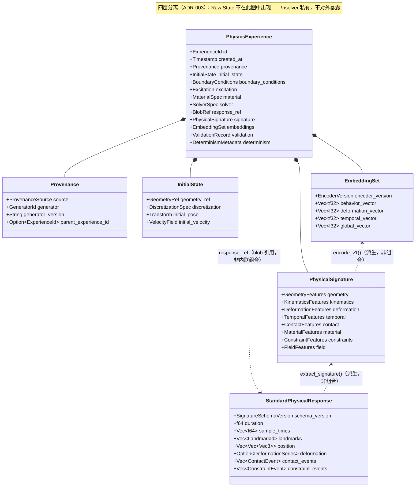
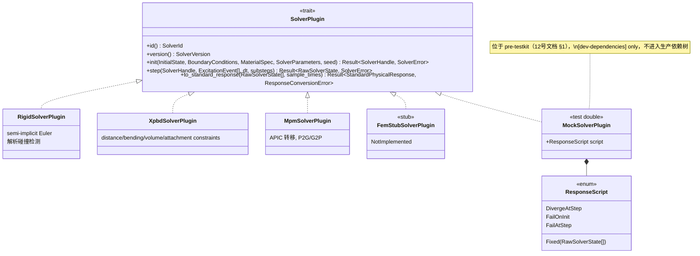
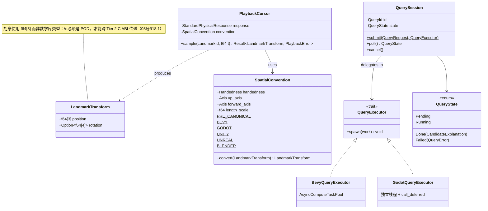
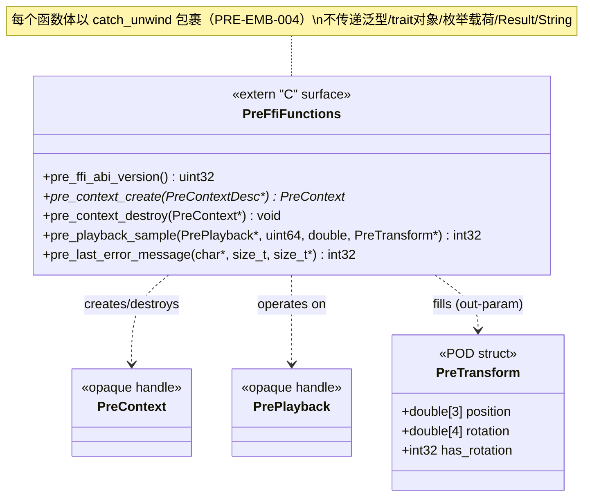
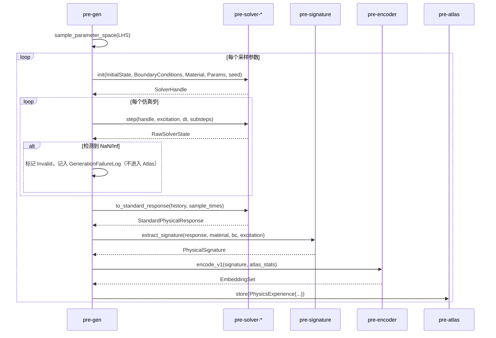
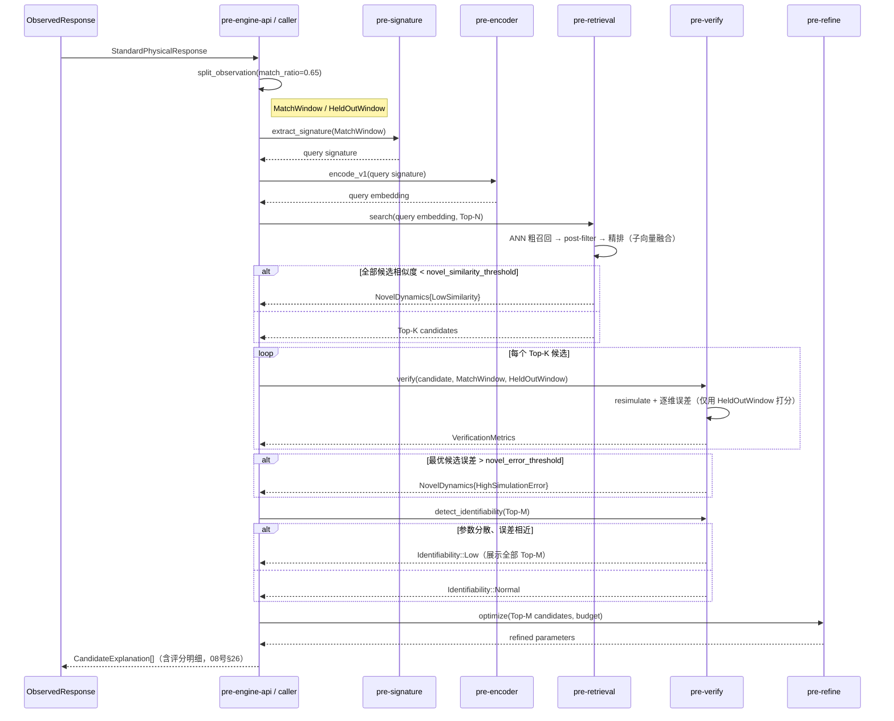
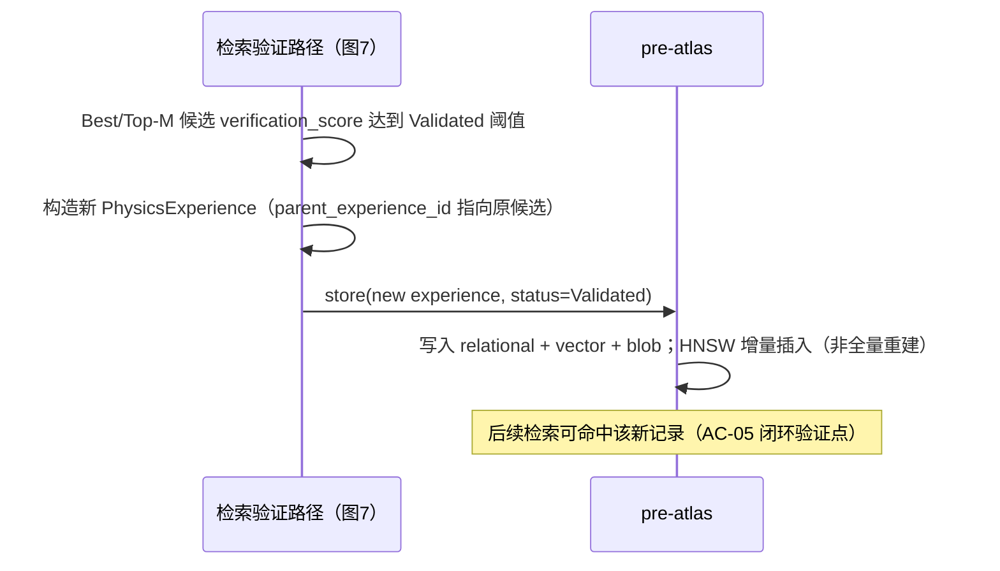
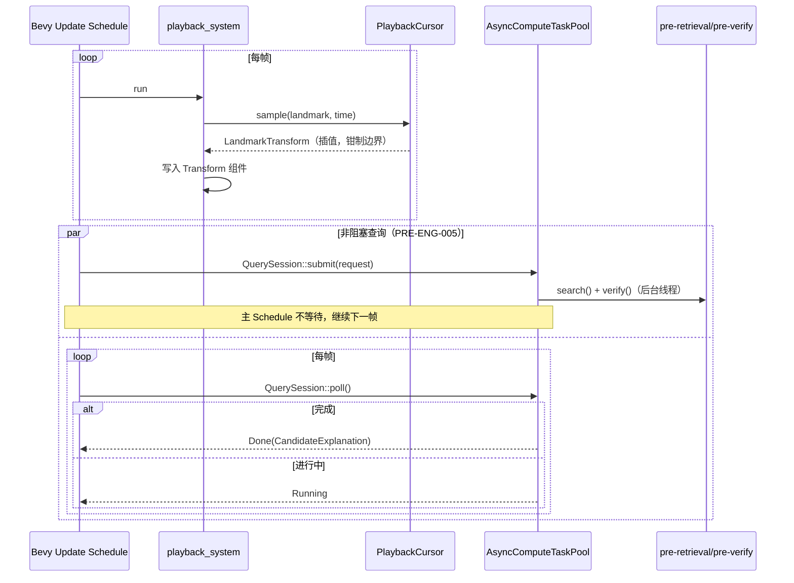
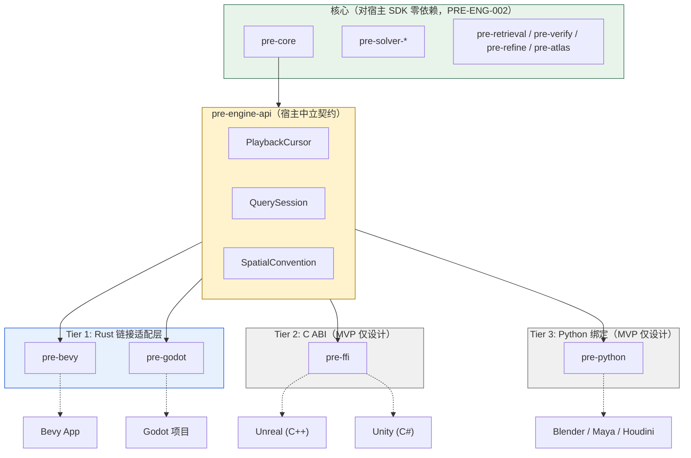
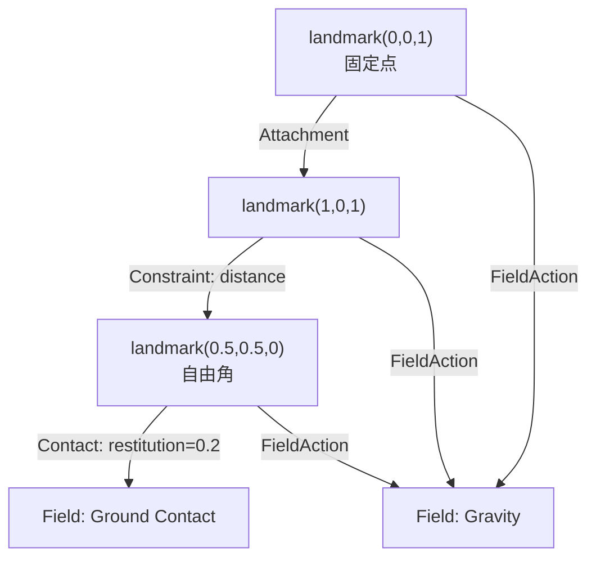

# Physical Retrieval Engine（PRE）ER図・UML図集

## 文书管理表

| 项目 | 内容 |
|---|---|
| 文书编号 | PRE-DOC-14 |
| 版本 | v0.1 |
| 状态 | Draft |
| 输入基线 | 02_PRE_Basic_Design.md（v0.1.5）、08_PRE_Detailed_Design.md（v0.1.4） |
| 定位说明 | 本文书不引入新需求或新决策，是 02/08 号文档中已有文字描述与 ASCII 框图的**可渲染图形化产物**（GitHub 原生渲染 Mermaid）。若图与正文文字冲突，以正文（02/08号文档）为准，本文书应视为过期并修正，而非另立事实来源。 |

## 改订履历

| 版本 | 日期 | 变更内容 | 作成者 |
|---|---|---|---|
| v0.1 | 2026-08-17 | 初版：ER 图（pre-atlas 关系型 schema）、UML 类图（核心数据模型、SolverPlugin 体系、pre-engine-api 契约、Tier 2 C ABI 表面）、UML 时序图（三条核心路径）、Physical Graph 示例图、Tier 分层组件图 | Claude |

---

## 目录

1. ER 图：`pre-atlas` 关系型 Schema
2. UML 类图：核心数据模型（PhysicsExperience 组合关系）
3. UML 类图：SolverPlugin trait 体系
4. UML 类图：`pre-engine-api` 宿主中立契约
5. UML 类图：Tier 2 C ABI 表面（API 设计可视化）
6. UML 时序图：生成路径
7. UML 时序图：检索验证路径
8. UML 时序图：学习闭环路径
9. UML 时序图：Tier 1 回放与异步查询桥接
10. 组件图：宿主分层集成（Tier 0~3）
11. Physical Graph 构造示例（图论构造能力）

---

## 1. ER 图：`pre-atlas` 关系型 Schema

对应 08号文档 §9.1。仅覆盖 relational store 部分；vector store（HNSW 索引文件）与 blob store（文件系统）不是关系型表，不纳入 ER 图，以 `experience_id` 外键概念上关联，图中以注释标注。

```mermaid
erDiagram
    EXPERIENCES ||--o| VALIDATION_METRICS : "验证后产生"
    EXPERIENCES ||--o{ GRAPH_EDGES_VIEW : "查询时派生（非持久表）"

    EXPERIENCES {
        text id PK "UUID v7"
        integer created_at
        text provenance_source
        text provenance_generator
        text parent_experience_id FK "自引用，指向 refinement 的源 experience"
        text solver_id
        text solver_version
        text material_model
        text validation_status "Candidate | Validated"
        text response_blob_path "指向 blob store，非关系型外键"
        integer signature_schema_version
        text signature_json
        integer encoder_version "可为空：尚未编码"
        text determinism_json
    }

    VALIDATION_METRICS {
        text experience_id PK_FK
        real position_error
        real velocity_error
        real deformation_error
        real frequency_error
        real damping_error
        real contact_timing_error
        real verification_score
        text identifiability "low | normal"
    }

    GRAPH_EDGES_VIEW {
        text experience_id FK "查询时限定范围（PRE-GRAPH-003）"
        text from_node
        text to_node
        text edge_kind "Contact|Constraint|Attachment|FieldAction"
    }
```

**读图要点**：`GRAPH_EDGES_VIEW` 用虚线语义标注为"非持久表"——它是 08号文档 §23.2 `build_graph_view()` 在查询时从 `signature_json`/`response_blob_path` 指向的数据现算得到的逻辑视图，ER 图中画出是为了表达"图论查询的数据来源"，不代表数据库中真实存在这张表（对应 ADR-013）。

对应需求：PRE-DATA-001~003, PRE-GRAPH-001。

---

## 2. UML 类图：核心数据模型

对应 08号文档 §2，展示 `PhysicsExperience` 的组合关系（非继承）。



**读图要点**：`PhysicsExperience *-- PhysicalSignature`（实心菱形，组合）表示 signature 内联存储；`PhysicsExperience ..> StandardPhysicalResponse`（虚线箭头，依赖/引用）表示 response 只存 blob 引用，不内联——这条区别直接对应 PRE-DATA-002（metadata 查询不触发 blob 读取）在类图层面的体现。

对应需求：PRE-DATA-001, PRE-PHY-001, PRE-PHY-005。

---

## 3. UML 类图：SolverPlugin trait 体系

对应 08号文档 §3~§6，含 §12 的 `MockSolverPlugin`（虚线区分生产实现与测试替身）。



对应需求：PRE-FR-002, PRE-FR-003, PRE-TK-002。

---

## 4. UML 类图：`pre-engine-api` 宿主中立契约

对应 08号文档 §18。展示 ADR-010 的核心主张——中立类型与状态机不依赖任何宿主 SDK。



对应需求：PRE-ENG-003~006, PRE-ENG-009。

---

## 5. UML 类图：Tier 2 C ABI 表面（API 设计可视化）

对应 08号文档 §21.1。这是本项目目前唯一面向外部语言的公开 API 边界，用类图表达其"仅不透明句柄 + POD"的约束（PRE-ENG-009）。



**读图要点**：故意不画"继承"或"组合"——C ABI 没有面向对象概念，句柄之间只有"由哪个函数创建/操作"这一种关系，图中全部用依赖箭头（`..>`）表达，这本身就是对 Tier 2 设计约束的图形化提醒。

对应需求：PRE-ENG-009, PRE-EMB-004。

---

## 6. UML 时序图：生成路径

对应 08号文档 §16.1。



---

## 7. UML 时序图：检索验证路径

对应 08号文档 §16.2，含窗口切分（ISS-009 修正）与参数不可辨识检测（ISS-006 修正）。



---

## 8. UML 时序图：学习闭环路径

对应 08号文档 §16.3。



---

## 9. UML 时序图：Tier 1 回放与异步查询桥接

对应 08号文档 §18.3, §19。以 Bevy 为例，Godot 语义相同（仅调度机制不同，见 08号文档 §20）。



---

## 10. 组件图：宿主分层集成（Tier 0~3）

对应 02号文档 §33.1 的 ASCII 图的 Mermaid 化版本，与该图逐一对应，不新增内容。



**读图要点**：Tier 2/3 用灰色标注"MVP 仅设计"，与 Tier 1 的实现状态做视觉区分——避免读者把这张图误读为"四个 Tier 现在都已实现"。

---

## 11. Physical Graph 构造示例（图论构造能力）

对应 02号文档 §36、08号文档 §23。以「布料一角固定、自由端接触地面」这一 XPBD 场景为例，展示 `build_graph_view()` 的产出与 `to_mermaid()` 的导出效果——本图是 08号文档 §23.4 `GraphExporter::to_mermaid()` 的**真实产出格式示例**，非独立绘制。



**遍历查询示例**（对应 08号文档 §23.3）：`traverse(start=L5, max_depth=2)` 从自由角出发、2 跳内可达节点为 `{L5, L1, Ground, Gravity}`——`L0` 因距离 3 跳而不在结果中，演示了 `max_depth` 硬上限（PRE-GRAPH-006）如何实际限制遍历范围，而非仅是文档中的口头约束。

对应需求：PRE-GRAPH-001, PRE-GRAPH-002, PRE-GRAPH-004.
